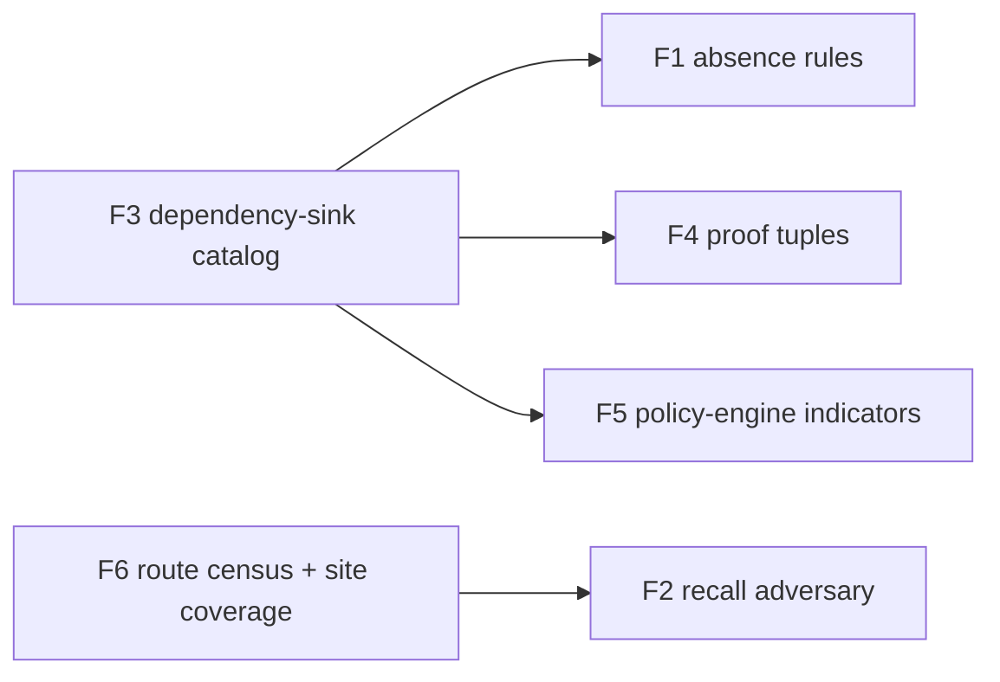

# sec-overlay recall gaps — design

Date: 2026-08-22
Source analysis: `/Users/christopher/Workspace/review_enforce/analysis_secoverlay-gap-rego-ssrf_20260817_1436.md`
(Section 10, gaps G6–G12)
Target plugin: `plugins/sec-overlay/skills/sec-overlay/`

All paths in this document are relative to `plugins/sec-overlay/skills/sec-overlay/`
unless the path starts with `plugins/` or `docs/`.

---

## 1. Why this specification exists

The source analysis studied one missed vulnerability: an SSRF through an Open Policy
Agent `http.send` call. Three properties made that bug invisible to the current
pipeline:

1. The dangerous act was the **absence** of a hardening option, not the presence of a
   dangerous call.
2. The sink lived **inside a dependency**, not in first-party code.
3. The route that reached it was **never enumerated**, and the coverage metric counted
   files and classes, so the omission did not appear as a gap.

The analysis called each gap a hypothesis. Section 2 records the result of testing every
hypothesis against the live source. Sections 4–9 define one feature per confirmed gap.

---

## 2. AS-IS verification result

Every hypothesis was tested by reading the current source. No hypothesis was refuted.
One hypothesis (G9) needed revision: the artifact the analysis said was missing exists,
but it derives its data from the wrong place.

| Gap | Verdict | Evidence in the live source |
|-----|---------|-----------------------------|
| G6 — no absence detector | Confirmed | `helpers/rules/smoke.yaml:1-17` holds the only first-party rules; both are positive patterns. `helpers/sec_overlay/astgrep.py:43-64` builds `ast-grep run --pattern 
` with one pattern and no relational or negative constraint, so "a call that lacks an option" cannot be expressed. The vendored clone carries `missing-*` rules only under `helpers/rules/semgrep/terraform/`, which is infrastructure code, not application code. |
| G7 — no dependency-sink catalog | Confirmed | A repository-wide search for a sink catalog returns nothing. `references/DETECTION_COVERAGE.md:30` still records `ssrf` as High confidence from semgrep and codeql. |
| G8 — no server-side policy-engine indicators | Confirmed | `references/attack-classes.md:26` lists only JavaScript indicators for `expr-eval-rce` (`jsep`, `expr-eval`, `mathjs`, `vm.runInContext`, `callee.apply`, `constructor.constructor`). No OPA, Rego, CEL, Sentinel, Starlark, Lua, or SpEL key appears anywhere in `references/`. |
| G9 — no deterministic route census | Confirmed, revised | `helpers/sec_overlay/route_control.py:16-35` already builds a route-to-control table, but `build_route_control_table` reads the routes from `kb/scan-profile.json`, which is the recon agent's own output. `check_recon_routes` (`route_control.py:47-56`) then checks recon against that table. The check is circular: a route recon never listed cannot become a gap. The comment at `route_control.py:32` records that `controls` is not even a scan-profile field. Recon is capped at about 40 rows (`agents/recon.md:42-43`) and is told to read no more of the repository than needed (`agents/recon.md:118-119`). |
| G10 — coverage counts classes, not sink sites | Confirmed | `helpers/sec_overlay/coverage_ledger.py:50-73` creates one surface per `attack_surface` class and marks it `reported` on one terminal finding. One confirmed SSRF finding therefore marks the whole SSRF surface covered. `helpers/sec_overlay/coverage.py:28` counts source files per language. |
| G11 — adversarial gates test precision only | Confirmed | `agents/critic.md`, `agents/judge.md`, `agents/adversarial-validate.md`, and `agents/review-filter.md` contain no recall or omission language. `agents/phase-adversary.md:38-41` does ask whether the phase missed an entry point, but its verdict set is `CONFIRMED`, `WEAKENED`, `INVALIDATED` (`agents/phase-adversary.md:42-46`) — every verdict can only shrink a claim — and its table has exactly one row per claim already made (`agents/phase-adversary.md:34`). The agent cannot add a surface nobody claimed. |
| G12 — proof tuples require a first-party sink | Confirmed | `agents/classes/ssrf.md:29-36` requires a fetch or HTTP-client call in the reviewed code. `agents/classes/injection.md:28-35` requires a concrete reachable sink such as `execute`. A sink inside a dependency satisfies neither. |

**Existing hook worth reusing.** `helpers/sec_overlay/rule_gaps.py:36-105` already records each
confirmed finding that no rule caught, and `rule_gaps.py:82` drafts a semgrep rule from it.
Feature 1 extends this path instead of building a second one.

---

## 3. How custom semgrep rules stay separate from the vendored clone

This answers a question raised during design. The separation needs no new mechanism.

- `.gitignore:27-28` (repository root) ignores exactly one directory:
  `plugins/sec-overlay/skills/sec-overlay/helpers/rules/semgrep/`. Nothing else under
  `helpers/rules/` is ignored. `helpers/rules/smoke.yaml` is already tracked and proves this.
- `helpers/sec_overlay/preflight.py:44` and `preflight.py:64-73` treat only
  `helpers/rules/semgrep/<lang>/*.yaml` as the vendored clone.
- `helpers/sec_overlay/sast.py:50-61` runs `semgrep --config <path>` once per configured path.
- `helpers/sec_overlay/prefilter.py:147-158` creates one backend unit per entry in
  `sast_plan.semgrep.rulesets`. Recon chooses that list (`SKILL.md:345`).

Therefore custom rules live in a new tracked directory, `helpers/rules/absence/`, a sibling
of the ignored `helpers/rules/semgrep/`. Recon adds `helpers/rules/absence` to
`sast_plan.semgrep.rulesets`. A `git clone` refresh of the vendored ruleset cannot touch
the custom directory, and no `.gitignore` change is needed.

**Rule.** Never place a first-party rule under `helpers/rules/semgrep/`. That directory is
disposable; `preflight.py` recreates it with `git clone --depth 1`.

---

## 4. Feature 1 — missing-safe-option detector rule family (G6)

### Problem it closes

The pipeline detects dangerous constructs that are present. It cannot detect a hardening
option that is absent. `rego.New(...)` without `rego.Capabilities(...)` is the case that
was missed.

### Files it touches

| Path | Change |
|------|--------|
| `helpers/rules/absence/` | New tracked directory. One YAML file per language. Each rule pairs a `pattern` for the constructor with a `pattern-not` for the required option. |
| `helpers/rules/absence/README.md` | New. States the directory contract and the rule-naming scheme. |
| `helpers/sec_overlay/astgrep.py:43-64` | Add relational constraints so an agent can probe absence live. `run_astgrep` gains optional `inside`, `has`, and `not_` arguments, emitted as an `ast-grep scan` rule on standard input rather than a bare `--pattern`. |
| `helpers/sec_overlay/astgrep.py:79-86` | Add `--not`, `--has`, and `--inside` flags to the CLI. |
| `agents/investigate.md:49-50` | Document the new flags in the allowed-tool list. |
| `SKILL.md:63-65` | State that `helpers/rules/absence` is a first-party ruleset, separate from the vendored clone. |
| `helpers/sec_overlay/rule_gaps.py:82` | `emit_semgrep_rule` gains an absence form: when a confirmed finding names a required-but-missing option, the drafted rule uses `pattern-not`. |
| `helpers/rules/README.md` | Update, per the folder-README rule. |
| `helpers/README.md`, `agents/README.md`, `references/README.md` | Update the folders this feature touches. |

### Acceptance criteria

1. A new bench corpus case reproduces the missed defect: a Go file calling `rego.New` with
   no `rego.Capabilities`. `python -m bench.run --corpus bench/corpus_seed --run-dir /tmp/bench`
   reports that case as a detected `locked` positive.
2. A negative twin in the same corpus — the identical call **with** `rego.Capabilities` —
   produces no candidate.
3. `uv run python -m sec_overlay.astgrep run --pattern 'rego.New($$$)' --not 'rego.Capabilities($$$)' --lang go --root <fixture>` prints the unhardened call and not the hardened one.
4. `uv run pytest` passes, including new tests for the relational-constraint path.
5. `uv run ruff check` and `uv run ty check` pass.

### Trade-off accepted

Two engines now express absence, and they can disagree. The semgrep pack is the
deterministic discovery path; the ast-grep flags are an interactive probe for an
investigate agent. Keeping both in agreement is manual work. An absence rule also
produces a candidate on every unhardened call site, including deliberate ones, so this
rule family raises candidate volume and depends on the investigate gate ladder
(`agents/investigate.md:95-131`) to settle each one.

---

## 5. Feature 2 — recall adversary challenging recon omissions (G11)

### Problem it closes

Every adversarial gate in the pipeline can only remove or weaken a claim. Nothing asks
what recon failed to list. `SKILL.md:15` states the principle "adversarial-review all
things", but `agents/phase-adversary.md:34` fixes the verdict table at one row per
existing claim, so an omission has no place to appear.

### Files it touches

| Path | Change |
|------|--------|
| `agents/recall-adversary.md` | New agent. Runs on opus, against a sonnet producer, preserving the model-family diversity invariant. Its input is the deterministic census from Feature 6 plus `kb/scan-profile.json`. Its only verdict is `OMISSION`, one row per census item absent from the profile, each citing a `file:line`. |
| `SKILL.md:28-47` | Add the recall gate after the existing phase-adversary gate for the recon phase. |
| `helpers/sec_overlay/phase_gate.py` | Record recall verdicts into `kb/gates/<phase>.json` beside the existing decisions. |
| `helpers/sec_overlay/route_control.py:80-93` | Route each `OMISSION` into `kb/coverage-ledger.json` as a `needs_follow_up` gap, so the never-drop invariant applies to omissions too. |
| `agents/README.md`, `helpers/README.md`, `SKILL.md` | Update. |

### Acceptance criteria

1. Given a fixture workspace whose deterministic census lists a route absent from
   `kb/scan-profile.json`, the recall gate writes at least one `OMISSION` row and the
   coverage ledger reports `completeness: "partial"`.
2. Given a census fully covered by the profile, the gate produces zero `OMISSION` rows and
   does not change `completeness`.
3. `tests/test_contracts.py` and `tests/test_wiring.py` stay green, proving no
   prompt-to-schema drift.
4. The new agent prompt states its model tier and its producer-adversary pairing, and
   `agents/README.md` lists it in the producer-to-adversary table.

### Trade-off accepted

A recall gate lowers precision by design. Every `OMISSION` is a claim that work is
missing, and some will be wrong. The gate is therefore restricted to comparing against a
deterministic census; it may not invent a surface from reasoning alone. This keeps the
false-omission rate bounded but also means the agent cannot flag a surface that the
census extractor does not know how to find.

### Dependency

This feature is not implementable before Feature 6. Without a code-derived census, the
recall adversary has nothing but the recon profile to compare against, which reproduces
the circularity recorded for G9.

---

## 6. Feature 3 — dependency-sink catalog driving recon routing (G7)

### Problem it closes

Nothing in the plugin records that a dependency call can itself be a sink. Recon routes
attack classes from first-party code shapes only, and
`references/DETECTION_COVERAGE.md:30` overstates SSRF coverage as a result.

### Files it touches

| Path | Change |
|------|--------|
| `references/dependency-sinks.yaml` | New. One entry per dependency API that reaches a dangerous operation inside the library. Each entry names: the package, the API, the sink behaviour, the attack class, the required hardening option, and a citation to the library documentation. |
| `references/README.md` | Document the new file and its consumer. |
| `helpers/sec_overlay/dependency_sinks.py` | New module. Loads the catalog, matches it against the target's manifests, and returns the matched entries. CLI-callable, matching the convention in the maintainer manual. |
| `helpers/sec_overlay/partition.py` | `reconcile_plan` adds the attack class of every matched catalog entry to `agents_to_spawn`, the same way `merge_custom_check_classes` does today (`SKILL.md:195`). |
| `agents/recon.md:42-43` | State that a matched catalog entry is a required row and does not count against the row cap. |
| `references/DETECTION_COVERAGE.md:30` | Correct the `ssrf` confidence claim: High for first-party sinks, and catalog-dependent for dependency-internal sinks. |
| `helpers/README.md`, `agents/README.md` | Update. |

### Acceptance criteria

1. A fixture target whose manifest declares the OPA Go module causes
   `python -m sec_overlay.dependency_sinks --root <fixture>` to return the OPA
   `http.send` entry.
2. For that fixture, `reconcile_plan` returns an agent list containing `ssrf` even when
   the recon profile omitted it.
3. A fixture with no catalog dependency returns an empty match and leaves the agent list
   unchanged.
4. The corrected `DETECTION_COVERAGE.md` row states the first-party and
   dependency-internal cases separately.
5. `uv run pytest`, `ruff check`, and `ty check` pass. The catalog stays stdlib-parseable:
   no new runtime dependency.

### Trade-off accepted

The catalog is hand-maintained and will always be incomplete. It converts an unbounded
problem into a bounded, auditable list, at the cost of needing an entry before a
dependency sink is ever seen. A catalog entry also forces an investigate agent to spawn,
which costs a full agent run even when the dependency is used safely.

**Note on file format.** The two existing YAML references
(`references/approved-crypto-algorithms.yaml`, `references/approved-key-sources.yaml`) set
the precedent, but their loader is deliberately limited: `helpers/sec_overlay/crypto_policy.py:5`
parses "YAML-ish" key, list, and scalar forms only, with no YAML dependency. Resolve the
format before implementation — see Section 12.

---

## 7. Feature 4 — class proof tuples admitting a dependency-internal sink (G12)

### Problem it closes

An investigate agent that finds the OPA call cannot confirm it. `agents/classes/ssrf.md:29-36`
requires a fetch or HTTP-client call in the reviewed code, and the sink is inside the
dependency.

### Files it touches

| Path | Change |
|------|--------|
| `agents/classes/ssrf.md:29-36` | Add a second admissible form for element 1 of the proof tuple: a call to a catalogued dependency API whose entry names an outbound-request sink, cited by catalog id and `file:line` of the call. |
| `agents/classes/injection.md:28-35` | Same second form for the reachable-sink element. |
| `agents/classes/README.md` | Document the dependency-internal form and the catalog gate. |
| `agents/investigate.md:124-131` | Extend the tool-grounding rule: a dependency-internal sink is grounded by a catalog receipt plus a mechanical receipt for the call site, recorded as `dependency-catalog:<entry-id>`. A catalog receipt alone never confirms. |
| `helpers/sec_overlay/evidence.py:14-22` | Add `dependency-catalog` to `_MECHANICAL` **and** to `TIER2_RECEIPTS`. Tier 2 locates code and never confirms alone (`evidence.py:59-91`), which is exactly the catalog-gated semantics. Both edits are required together: the assertion at `evidence.py:22` fails if the tiers stop partitioning `_MECHANICAL`. |
| `references/prompt-constants.md` | Update the `TOOL_TRUST` block to name the new namespace. |
| `agents/README.md`, `references/README.md`, `helpers/README.md` | Update. |

### Acceptance criteria

1. A finding whose `evidence_sources` holds `dependency-catalog:<id>` together with
   `ast-grep:sanity` for the call site passes `python -m sec_overlay.findings_gate`.
2. A finding whose only sink receipt is `dependency-catalog:<id>`, with no mechanical
   receipt for the call site, is rejected by the same gate.
3. A finding citing a catalog id that does not exist in `references/dependency-sinks.yaml`
   is rejected.
4. `tests/test_contracts.py` still passes, proving the prompt text and the schema agree.

### Trade-off accepted

This widens what counts as proof, which is the direct precision cost. The catalog gate is
the limit: proof may name a dependency-internal sink only when a catalog entry already
describes that sink, so the widening is exactly as large as the reviewed catalog and no
larger. The alternative — accepting any documented dependency behaviour — was rejected
because it lets model recall substitute for a receipt.

### Dependency

Requires Feature 3. The catalog is the gate; without it there is no receipt to cite.

---

## 8. Feature 5 — server-side rule and policy engine indicators (G8)

### Problem it closes

`references/attack-classes.md:26` recognises only JavaScript expression evaluators. A
service that accepts and evaluates a Rego, CEL, Sentinel, Starlark, Lua, or SpEL
document has no indicator, so recon has no reason to route the class.

### Files it touches

| Path | Change |
|------|--------|
| `references/attack-classes.md:26` | Extend the `expr-eval-rce` indicator list with server-side policy and rule-engine keys: Rego and OPA, CEL, HashiCorp Sentinel, Starlark, Lua via `gopher-lua` or `LuaJIT`, and Java SpEL. |
| `references/attack-classes.md` | Add the endpoint-shape indicator: a route that accepts a policy or rule document as input, for example a validate-policy endpoint. |
| `references/dependency-sinks.yaml` | Add the corresponding catalog entries, so an indicator match and a catalog match agree. |
| `agents/classes/` | Add or extend the class file that owns `expr-eval-rce`, so the new engines have a class boundary and a proof tuple. |
| `references/README.md`, `agents/README.md` | Update. |

### Acceptance criteria

1. A fixture repository containing a Rego evaluation call and a policy-accepting route
   causes recon to include `expr-eval-rce` in `attack_surface`.
2. Every engine added to the indicator list has a matching entry in
   `references/dependency-sinks.yaml`, checked by a test that compares the two files.
3. No indicator is added without a documentation citation recorded in the catalog entry.

### Trade-off accepted

An indicator list is a keyword match and will fire on any repository that merely mentions
one of these engines, including a test fixture or a comment. That raises recon routing
volume. The test in criterion 2 keeps the indicator list and the catalog from drifting
apart, but neither file can tell a real evaluation from a mention; the investigate gate
ladder does that.

### Dependency

Shares data with Feature 3. Implement Feature 3 first so the catalog exists to hold the
entries.

---

## 9. Feature 6 — deterministic route census and sink-site coverage keying (G9, G10)

### Problem it closes

Two problems with one root. First, the route table is built from recon's own output
(`helpers/sec_overlay/route_control.py:26-35`), so recon cannot be checked against
anything independent. Second, the coverage ledger keys a surface on attack class and marks
it covered on one terminal finding (`helpers/sec_overlay/coverage_ledger.py:50-73`), so an
unexamined sink site inside a "covered" class is invisible.

### Files it touches

| Path | Change |
|------|--------|
| `helpers/sec_overlay/route_census.py` | New module. Enumerates routes from framework registration shapes using ast-grep, writes `kb/route-census.json` with one entry per route and its `file:line`. CLI-callable. |
| `references/route-frameworks.yaml` | New. One entry per framework: the language, the registration pattern, and how to read the path and method from a match. |
| `helpers/sec_overlay/route_control.py:16-35` | `build_route_control_table` reads `kb/route-census.json` when it exists and falls back to the profile only when the census is empty. The fallback is recorded in the table so a reader can tell which source was used. |
| `helpers/sec_overlay/route_control.py:47-56` | `check_recon_routes` now compares the census against the profile, which makes the check non-circular. |
| `helpers/sec_overlay/coverage_ledger.py:50-73` | Add a per-site surface: for each candidate sink site discovered by the deterministic pass, record `reported`, `no_issue_found`, or `needs_follow_up` for that site, not only for its class. `completeness` stays `complete` only when no site needs follow-up. |
| `references/coverage-ledger.schema.json` | Add the per-site surface shape. |
| `SKILL.md:185` | Replace the regex call-edge heuristic note with the census step, or state how the two relate. |
| `SKILL.md:210` | State that the ledger keys on sink sites as well as classes. |
| `helpers/README.md`, `references/README.md`, `SKILL.md` | Update. |

### Acceptance criteria

1. For a fixture with three registered routes, `python -m sec_overlay.route_census --root <fixture>`
   writes exactly three entries, each with a resolvable `file:line`.
2. With that census present and a profile listing only two of the three routes,
   `check_recon_routes` returns exactly one gap, naming the third route.
3. A workspace holding one confirmed finding and one un-triaged candidate site of the same
   class reports `completeness: "partial"`, not `"complete"`.
4. `validate_coverage_ledger` rejects a ledger claiming `complete` while any site is
   `needs_follow_up`, preserving the invariant stated at `coverage_ledger.py:1-8`.
5. A repository whose framework is absent from `references/route-frameworks.yaml`
   produces an empty census, the profile fallback, and a recorded note saying so — never a
   silent claim of full enumeration.

### Trade-off accepted

The census is only as good as the framework list, so an unknown framework yields an empty
census. Criterion 5 makes that state loud instead of silent, which is the honest failure
mode but also means the recall adversary is inert on an unsupported stack. Per-site
coverage keying will also move many audits from `complete` to `partial`. That is the
intended correction, and it will read as a regression to anyone who trusted the previous
metric.

---

## 10. Implementation order and dependencies

Leverage order, as the source analysis ranked it, is Feature 1, 2, 3, 4, 5, 6.
Dependency order is different. Build in this order:

1. **Feature 3** first. Features 1, 4, and 5 all read the catalog it creates.
2. **Feature 5** next, because it populates the catalog with the entries that reproduce
   the original missed bug.
3. **Feature 1** and **Feature 4** next, in either order. Together they let the pipeline
   both find and confirm the reproducer.
4. **Feature 6** next. It is independent of 1, 3, 4, and 5.
5. **Feature 2** last. It cannot work before Feature 6.

Features 1, 3, 4, and 5 together are the smallest set that detects and confirms the
original missed defect. Features 6 and 2 are what stop the next omission of the same
shape from being reported as complete coverage.

---

## 11. Constraints that apply to every feature

- **Stdlib only.** The core has no runtime dependency
  (`plugins/sec-overlay/CLAUDE.md`, Conventions). Do not add one.
- **Test-first.** Each feature ships its tests in the same change.
- **Folder README in the same commit.** Enforced by
  `scripts/hooks/pre-commit-check.sh`. Do not bypass with `--no-verify`.
- **Preserve the hard rules in every agent prompt** — model-family diversity, the
  tool-receipt safety contract, and the count-invariant verdict tables. Feature 2 adds a
  new table rather than changing `agents/phase-adversary.md`'s invariant, for this reason.
- **Bench regression.** A `locked` positive that stops being detected is a hard failure.
  Run `python -m bench.run --corpus bench/corpus_seed --run-dir /tmp/bench --workspaces <dir>`
  before and after each feature.
- **One plugin version bump per shipping change**, per repository governance.

---

## 12. Open items

- The loader for `references/dependency-sinks.yaml` needs a decision.
  `helpers/sec_overlay/crypto_policy.py:5` states its parser handles "YAML-ish" files with
  simple key, list, and scalar forms only, and it takes no YAML dependency. A catalog entry
  carrying six fields per API is a nested structure that parser will not read. Either keep
  each catalog entry flat enough for the existing loader, or use JSON, which the stdlib
  parses. Do not add PyYAML.
- Which class file owns `expr-eval-rce` is not yet established. `agents/classes/` has no
  file of that name today; Feature 5 must either create one or extend the class that
  currently absorbs the shape.
- The relational-constraint form for `ast-grep` in Feature 1 assumes `ast-grep scan` with
  a rule on standard input. Verify the installed `ast-grep` version supports that
  invocation before writing the wrapper. Untested as of this document.
