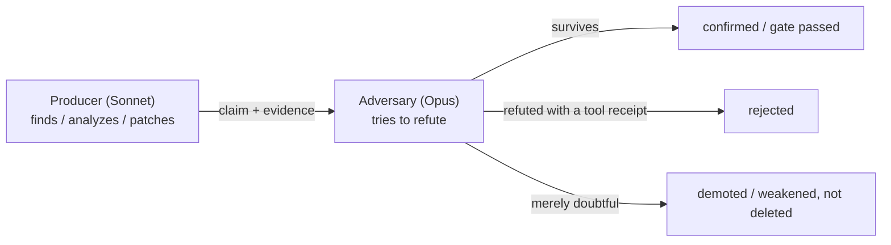
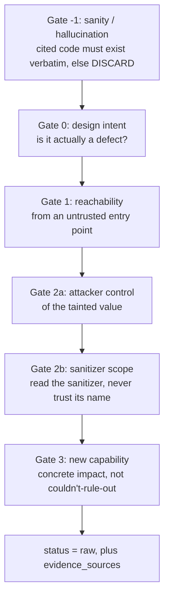

# sec-overlay agent prompts

Every `.md` file under [`agents/`](/plugins/sec-overlay/skills/sec-overlay/agents/) is a
**prompt**: a complete set of instructions for one LLM subagent doing one job in the audit. The
Python in [`helpers/`](helpers.md) never "decides" whether something is a vulnerability — it
runs tools, moves files, and enforces rules. The *judgement* — "is this reachable? is this
input attacker-controlled? is this fix correct?" — happens inside these prompts. Nothing here
is code: a prompt is text with `{{PLACEHOLDER}}` tokens the orchestrator fills in before
spawning the subagent (see [Template tokens](#template-tokens-the-orchestrator-substitutes)).

## Producer vs. adversary

The harness assumes any single LLM will confidently be wrong sometimes, so almost every
important claim is made by one agent and then attacked by a different one on a **stronger,
different model family**:

- **Producers run on Sonnet** — cheaper, recall-biased; when unsure, they keep the finding.
- **Adversaries run on Opus** — a different model family, different blind spots, and they
  default to *demoting* under uncertainty.
- **The judge runs on a cheap, tool-free model** — it only checks for severity inflation.

*The safety contract in one diagram: adversarial reasoning alone can demote or weaken a
finding, but only a competing mechanical tool receipt can delete a tool-backed one.*

**The rule that governs every gate in this harness:** adversarial reasoning alone can demote or
downgrade a finding, but only a competing mechanical tool receipt can delete a tool-backed
finding. See [helpers — the tool-receipt gate](helpers.md#the-tool-receipt-gate) for where this
is enforced in code.

## The pipeline, as prompts

Read top to bottom — this is the order the orchestrator spawns them (see
[pipeline](pipeline.md) for the deterministic steps interleaved between these).

| Phase | Prompt | Model | Job |
|---|---|---|---|
| C1 context | `context-ingest.md` | sonnet | discovers repo docs/prior scans, verifies claimed controls against code |
| C1 context | `context-adversary.md` | opus | pressure-checks that verification |
| Analysis | `recon.md` | sonnet | surveys the repo → `kb/scan-profile.json` |
| Analysis | `architecture.md` | sonnet | components/data-flows/trust-boundaries → `kb/architecture.md` |
| Analysis | `threat-model.md` | sonnet | attacker profiles + hunt list → `kb/THREAT_MODEL.md` |
| Analysis (each of the three) | `phase-adversary.md` | opus | re-derives each claim from code; verdicts → `kb/gates/<phase>.json` |
| Investigate | `investigate.md` + `classes/<cls>.md` | sonnet, parallel per class | walks the [gate ladder](#the-investigate-gate-ladder) → `raw`/`rejected` |
| FP ladder | `critic.md` | sonnet | production-viability filter (reject debug-only/dead/test-fixture code); demotes on doubt, never hard-rejects |
| FP ladder | `judge.md` | cheap, no tools | severity-inflation adjudicator; uphold / downgrade / flag |
| FP ladder | `validate.md` | opus, different family | assumes every finding is wrong and tries to refute it; survival = `confirmed` |
| Patch | `patch.md` | opus | proposes a minimal diff into `patch_diff`, applied only to a throwaway copy |
| Patch | `validate-fix.md` | opus, two personas | security-architect + penetration-tester independently check the patch; `no_new_vulnerabilities` regression is non-waivable |
| Red team | `trace.md` | opus | backward-traces each confirmed sink to an entry point; sets `reachability` |
| Red team | `redteam.md` | sonnet | splits confirmed findings into `static-settled` vs `needs-runtime`; writes `runtime_test` |
| Red team | `redteam-adversary.md` | opus | strips settleable-from-source or payload-mismatched items |
| Postflight | `postflight.md` | sonnet | durable security-profile notes to `kb/prior_context.json` |

**`judge` and `validate` must never run concurrently against the same finding file** — the last
writer silently drops the other's field. This is enforced by orchestration order (dispatch
judge, wait for its writes to persist, then dispatch validate), not by code.

### Optional extension agents

| Prompt | Role |
|---|---|
| `factcheck.md` | fresh-context re-verification of a finding's citations/scope/severity against source (catches drift) |
| `variant-hunt.md` | amplifies one confirmed finding into its family: enqueues sibling call sites as new candidates |
| `bugchain.md` | looks across the confirmed set for chains — individually low findings that compose into a critical |
| `tune-config.md` | optional ratcheted loop (≤3 rounds): authors targeted semgrep rules for uncovered classes |
| `correlate-combiner.md` + `cross-repo-adversary.md` | cross-repo: see [Cross-repo correlation](cross-repo-correlation.md) — these gate correlation *verdicts*, not per-repo findings, and carry the same producer/adversary pattern applied to a joined multi-repo artifact rather than a single finding |

## The investigate gate ladder

`investigate.md` is spawned in parallel, once per attack class in
`scan-profile.agents_to_spawn` (with `{{ATTACK_CLASS}}` substituted and the matching
[`classes/<cls>.md`](#classes--cwe-class-extension-prompts) extension appended). It is
**recall-biased**: when unsure it keeps a finding as `raw` rather than dropping it — later
stages are the precision filter. Before confirming, it must also **refute its own finding
first**: write the single strongest reason the finding is not exploitable, and only confirm if
that reason does not hold (`agents/investigate.md` step 4.5).

*Each rung needs a recorded mechanical receipt before the next one is evaluated; a finding that
fails Gate -1 is discarded with no further reasoning.*

On pass N>1, prior `rejected` findings are injected as `{{FP_FEEDBACK}}` negative examples so
the agent does not re-raise a known false positive.

## `classes/` — CWE-class extension prompts

Eleven small prompts under
[`agents/classes/`](/plugins/sec-overlay/skills/sec-overlay/agents/classes/) — `injection`,
`ssrf`, `authz`, `authn`, `crypto`, `config`, `business-logic`, `prompt-injection`,
`context-bleed`, `excessive-agency`, `resource` — each appended to `investigate.md` /
`patch.md` for that class, supplying:

1. **Canonical fix shape** (e.g. injection → parameterized query; crypto → AEAD or slow KDF).
2. **Discrimination boundary** — an explicit IS/IS-NOT so a finding routes to exactly one class
   (SSRF is not open-redirect; authz is not authn).
3. **Proof tuple** — the required three-part evidence: source, defense/bypass, sink/impact.
4. **Instance-preservation rule** — do not collapse sibling instances into one finding.

`test_wiring.py` checks that every class prompt carries the proof tuple and the anti-collapse
rule.

## Template tokens the orchestrator substitutes

| Token | Meaning |
|---|---|
| `{{TARGET}}` | absolute path to the code being scanned |
| `{{WORKSPACE}}` | the harness workspace (`kb/`, `findings/`, `state.json`) |
| `{{OVERLAY_ROOT}}` | absolute path to `skills/sec-overlay/` (so agents find `references/`) |
| `{{HELPERS_DIR}}` | absolute path to `helpers/` (for `python -m sec_overlay.*` calls) |
| `{{REPO_ROOT}}` / `{{SCAN_SCOPE}}` | git top-level of the target + scan sub-path, from `kb/scan-scope.json` |
| `{{ATTACK_CLASS}}` | one class key (investigate agents) |
| `{{PHASE}}` | `recon` / `architecture` / `threat-model` / `context` (phase-adversary) |
| `{{FP_FEEDBACK}}` | prior-pass rejected findings, as negative examples |
| `{{ROUND}}` | tuning iteration number (tune-config) |

Every agent wraps untrusted repo text in the trust envelope and imports the
[`references/prompt-constants.md`](references.md#prompt-constantsmd--the-constitution) blocks.
Agents most prone to cross-phase field writes (`investigate.md`, `critic.md`, `validate.md`,
`trace.md`, `patch.md`, `validate-fix.md`, `redteam.md`, `context-ingest.md`,
`context-adversary.md`, `phase-adversary.md`, plus `architecture.md`/`threat-model.md` as
readers) import `FIELD_OWNERSHIP` to enforce that each `Finding` field is owned by exactly one
phase.

## Editing rules

These are load-bearing, not prose, per [`agents/README.md`](/plugins/sec-overlay/skills/sec-overlay/agents/README.md):

1. **Model-family diversity** — never let a producer be its own sole confirmer.
2. **Tool-receipt safety contract** — reasoning alone demotes; only a competing tool receipt deletes.
3. **Count-invariant verdict tables** — an adversary/validator must emit exactly one row per
   input claim/finding; a missing row is a failure, not a silent drop.
4. **The gate ladder order** in `investigate.md` — reordering changes the evidence bar.
5. **Class IS/IS-NOT boundaries and proof tuples** in `classes/*.md` — blurring them misroutes
   or duplicates findings.

When a prompt here changes, `agents/README.md` must change in the same commit — enforced by the
repo's [doc-update-guard hook](../../governance/hooks-and-commits.md).

## Related pages

- [Pipeline](pipeline.md) — where each phase above fits in the full audit sequence.
- [Helpers](helpers.md) — the deterministic modules that enforce the tool-receipt gate these
  prompts cannot bypass.
- [References](references.md) — `prompt-constants.md`'s twelve blocks every prompt imports.
- [Cross-repo correlation](cross-repo-correlation.md) — `correlate-combiner.md` and
  `cross-repo-adversary.md` in detail.
