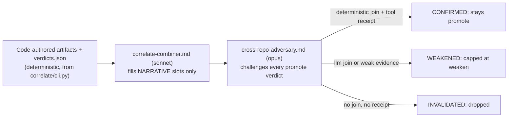

# Cross-repo correlation

When one product spans several repositories — a solution repo defining RBAC privileges, a
service repo enforcing them, an infra repo wiring the entitlements — a per-repo
[audit](pipeline.md) can't see a control that lives in a *different* repo. `correlate/`
(`helpers/sec_overlay/correlate/`, 11 modules) joins N already-completed per-repo scans
deterministically, with **no source reads and no LLM** for the joins themselves.

**This is a separate, opt-in, multi-repo capability, not a stage in the single-repo phase
order.** `SKILL.md`'s numbered phase list (0 through 14, plus C1/C2) contains no "correlate"
step — correlation runs *after* each member repo already has its own independent
`.sec-overlay/<slug>/` workspace from the [pipeline](pipeline.md) above. It was designed for a
real four-repo campaign (`docs/plans/2026-08-07-cross-repo-correlation-design.md` records the
motivating case: control→enforcement handoffs and shared-dependency CVEs that were, before this
capability existed, correlated by hand).

## Reaching it: `/sec-overlay:audit` or the manifest CLI directly

`/sec-overlay:audit <repo> <repo> ...` (two or more repo arguments) drives this end to end: it
audits each repo in turn (each resuming from its own recorded stages), infers each repo's
correlation `role` from its `kb/scan-profile.json` (`sec_overlay.run.infer_role` —
`rbac-source`/`service-enforcer`/`infra`, defaulting to `infra` on ambiguity since an
over-eager `rbac-source` label fabricates a `control-enforces` edge), confirms the repo list and
roles with the operator, then synthesizes the manifest (`sec_overlay.run.synthesize_manifest`)
and calls the core below — so a manifest no longer needs to be hand-authored. See
[running an audit](running-an-audit.md#the-driven-audit-sec-overlayaudit) for the exact
commands. The manifest schema and CLI themselves are unchanged and remain callable directly:

## The correlation workspace and CLI

```bash
python -m sec_overlay.correlate --manifest <manifest.json> --out <correlation-dir>
```

`correlate/cli.py`'s `main()` runs the whole deterministic core in one pass:
`load_manifest` → `ingest(manifest)` (read each member's sidecar findings, tagged with a
`member_key`) → the three edge builders (`shared_dependency_edges`, `same_class_recurrence_edges`,
`control_enforces_edges`, concatenated) → `write_edges` → `member_coverage(manifest)` (reads
each member's `kb/coverage-ledger.json` disposition per class) → `rethreshold(ings, edges,
coverage)` → `write_verdicts` → `build_artifacts(manifest, ings, edges, verdicts)` +
`write_artifacts` → a combined `report.sarif` via `to_correlation_sarif`. The
`CorrelationWorkspace` (`correlate/workspace.py`) is a **read-only join**: it never re-scans a
member repo, it only reads each one's existing `findings/` and `kb/` folders.

## The three deterministic edge types

`correlate/edges.py` builds three kinds of cross-repo edges from the ingested findings, all
without an LLM:

- **`shared_dependency_edges`** (`shared-dependency`) — the same `(package, CVE)` appears in
  ≥2 members' `deps` findings; a pure deterministic join on the OSV id.
- **`same_class_recurrence_edges`** (`same-class-recurrence`) — the same `cls` and code-shape
  fingerprint recur across ≥2 members, tagging the pattern systemic.
- **`control_enforces_edges`** (`control-enforces`) — a claimed control / authz-definition
  finding in one member links to the handler/proto that must enforce it in another, via a
  deterministic string-match join key (e.g. a proto RPC permission name matching a `src/rbac`
  privilege name) when one exists; the edge's `detail["join"]` is either `"deterministic"` or
  `"llm"`, and only the former can drive a promotion below.

## The rethreshold promote/demote/weaken/coverage-gap invariant

`correlate/rethreshold.py`'s `rethreshold()` resolves each `needs-deployment-testing` finding's
"out-of-repo" barrier using *another* ingested member's own, already adversary-validated
findings and coverage ledger — never by re-reasoning about the barrier from scratch. For each
such finding, it looks up the `control-enforces` edge that resolves it and branches on the
resolving (enforcer) member's own status:

- **No resolving edge at all** → **coverage-gap** (low confidence; the enforcing member was
  never ingested, so the barrier cannot be assessed).
- **The enforcer's coverage-ledger disposition is `no_issue_found`** (it investigated the class
  and found no issue — a compensating control) → **demote** to `rejected`.
- **The barrier is absent** (the enforcer's own finding is `confirmed`/`needs-deployment-testing`,
  or its ledger disposition is `needs_follow_up`/`reported`) **and the edge's join is
  `deterministic`** → **promote** to `confirmed`, with an evidence chain citing the enforcer.
- **The same barrier-absent case, but the edge's join is `llm`** → **weaken** only (status stays
  `needs-deployment-testing`, evidence chain notes "llm-join — not receipt-grade") — this branch
  can never promote, regardless of how confident the join's reasoning is.
- **Otherwise** (an edge exists, but the enforcer shows neither `no_issue_found` nor a barrier-
  absent signal) → **coverage-gap**, a second, distinct trigger from the no-edge case above.

A `CorrelationVerdict` (`base_status`, `correlated_status`, `direction`, `edge`,
`evidence_chain`, `confidence`) is recorded **only in the correlation workspace** — the
resolving member's own finding files are never mutated. This preserves the same safety
contract as the single-repo [tool-receipt gate](helpers.md#the-tool-receipt-gate): a join
either has a deterministic, reproducible receipt behind it, or it cannot promote.

## The combiner-vs-adversary pair

Correlation reuses the [producer-vs-adversary pattern](agents.md#producer-vs-adversary),
applied to a joined multi-repo artifact instead of a single finding:


*The adversary can only cap or drop a promotion — never confirm one the deterministic join and
receipts don't already support.*

- **`agents/correlate-combiner.md`** (sonnet): writes narrative for the four combined
  artifacts — `ARCHITECTURE`, `THREAT_MODEL`, `REDTEAM`, `FINDINGS` — filling only the
  `<!-- NARRATIVE: <slot> --> ` markers inside skeletons that already contain code-authored
  mermaid diagrams and tables. It **must not** edit, reorder, or regenerate any diagram or
  table; every narrative claim must cite a verdict's `finding_ref` and `evidence_chain`, never
  assert a cross-repo exploitability the verdicts don't already carry. Red-team directives use
  `$SHELL_VAR` placeholders — never a literal secret.
- **`agents/cross-repo-adversary.md`** (opus, different family, fresh context, read-only):
  independently pressure-checks every `promote`-disposition verdict before it's applied. Its
  hard rules: a `promote` can only survive if its resolving edge has `join: deterministic` (an
  `llm`-joined edge is capped at `weaken`, however strong the reasoning); the cited resolving
  member's finding or coverage-ledger entry must actually exist — re-derived from
  `findings/*.json`, never trusted from the verdict text alone; a verdict's final confidence is
  the *lower* of its two endpoints' confidences. It returns one row per `promote` item
  (`CONFIRMED` / `WEAKENED` / `INVALIDATED`), and the orchestrator drops any promotion the
  adversary does not `CONFIRM`, recording the result into `correlation/gates/cross-repo.json`.

## Outputs

The correlation workspace writes four combined Markdown artifacts (architecture, threat model,
red team, findings — each a mix of code-authored diagrams/tables and agent-authored narrative)
plus a multi-run cross-repo `report.sarif` (`correlate/xrepo_sarif.py`: one SARIF run per
member repo plus one correlation run).

## Related pages

- [Pipeline](pipeline.md) — the single-repo audit each member repo runs independently before
  correlation begins.
- [Agents](agents.md) — the producer-vs-adversary pattern this subsystem reuses.
- [Helpers](helpers.md) — where `correlate/` sits in the module map alongside the single-repo
  core.
- [Running an audit](running-an-audit.md#the-driven-audit-sec-overlayaudit) — the
  `/sec-overlay:audit` command and `sec_overlay.run` role-inference/manifest-synthesis helpers
  that now reach this capability without a hand-authored manifest.
