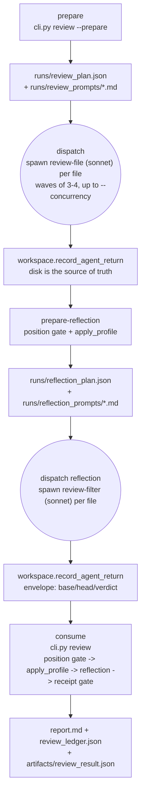

# sec-overlay diff-scoped review (`sec-overlay review`)

`sec-overlay review` is a **separate, lighter pipeline** from the full [audit](pipeline.md).
Instead of a multi-phase, multi-agent campaign over a whole repository, it scores only the
lines one diff (`base..head`) changed, with one producer prompt per changed file and no
adversary pair. It exists to run cheaply and repeatedly on pull requests — as a GitHub Action
(below) or as a direct CLI invocation — where a full audit would be too slow and too broad.

## Why this track has no adversary

Every other producer in this harness ([agents](agents.md)) is paired with an opus adversary
on a different model family. Diff-review is not: its safety guarantee is a **mechanical
code-level veto** instead of a second model opinion. `review-filter.md`'s reflection pass
(below) can only *retract* a kept finding, and a hardcoded `PROTECTED_SUBJECT_CLASSES` set in
`sec_overlay.reflection` vetoes a retraction of specific finding classes regardless of what
the model says. Positioning (below) is a deterministic ladder, not a model judgement. This is
a deliberate trade: diff-review buys speed and low per-PR cost by substituting mechanical
gates for the audit's full producer/adversary ladder — it is not the audit pipeline's
[phase-adversary gate](pipeline.md#the-phase-adversary-gate) run on a smaller scope.

## The three-step loop: prepare, dispatch, consume

Review mode has no phase driver like the full audit — it is a loop the main agent runs
directly, over one `review-file` subagent per reviewable file:


*Every step persists to disk before the next reads it; the skill never trusts a subagent's
chat summary, only `workspace.record_agent_return`'s on-disk artifact.*

```bash
cd skills/sec-overlay/helpers
# 1. prepare — write runs/review_plan.json + one prompt per reviewable file
uv run python -m sec_overlay.cli review --base <ref> --head <ref> --root <path> --prepare
# 2. dispatch — the orchestrator spawns review-file subagents per plan entry (not shown)
# 3. prepare-reflection — read recorded returns, run the position gate + apply_profile
uv run python -m sec_overlay.cli review --base <ref> --prepare-reflection
# 4. dispatch reflection — the orchestrator spawns review-filter subagents (not shown)
# 5. consume — run the full gate chain and write report.md + review_ledger.json + review_result.json
uv run python -m sec_overlay.cli review --base <ref> --head <ref> --root <path> \
  --profile security --model <id>
```

**Dispatch discipline.** Both the review-file and review-filter waves fan out 3–4 subagents
at a time, never exceeding `--concurrency` (default 8, range 1–128) — the Python core
validates and records this bound but never dispatches an agent itself; the dispatching agent
is the enforcement point. `--timeout` (default 600s) and `--max-git-procs` (default 16) bound
the git-fetch thread pool that gathers each file's diff/blob content. Every one of these
values must be passed identically to every invocation of one review run — a resumed run with
a different `--model` is rejected (exit 2), never silently mixed.

## The position gate — confirm a finding is where it claims to be

`sec_overlay.positioning.resolve_position` is a four-rung ladder run before any profile logic,
in order: hunk match in the claimed file (`exact`, the only rung kept), whole-file match in
the claimed file (`relocated`/`whole-file-match`), match in exactly one *other* changed file
(`relocated`/`cross-file-match`), else decline (`needs-position-review`). Two or more matches
at any rung decline rather than guess. It never uses fuzzy string matching — a fuzzy match
presented as an exact location is exactly the defect this module exists to prevent. Declines
are listed in `report.md`'s "Position review required" section, never silently dropped.

## Review profiles — `security` vs. `general`

`sec_overlay.review_findings.apply_profile(findings, profile)` runs after the position gate:

- **`security`** (the default) reproduces the original gate-ladder behavior byte-for-byte —
  any finding marked by [gate A–E](references.md#prompt-constantsmd--the-constitution)
  (`EXCLUSION_RULES`) is dropped.
- **`general`** relaxes gates A and B (no-attacker-path, no-security-impact) for a finding
  whose defect class is `null-dereference`, `thread-safety`, `resource-leak`,
  `error-swallowing`, or `injection` (`GENERAL_PROFILE_EXCLUSION_RULES`) — gates C, D, E still
  apply to everything. `general`'s output is a **strict superset** of `security`'s; the two
  rule sets never mix.

`review-file.md` (the producer) is the sole source of a `code_comment`; every finding it
produces carries `FindingStatus.RAW` and `REVIEW_AGENT_CLAIM` (`llm-claimed:review-agent`) as
its only evidence, both fixed in code — the model's response can never claim a different
status or evidence source. A comment naming a path outside the reviewing unit's membership is
**discarded, never converted** (`sec_overlay.review_agent.parse_review_response`'s Strict
Focus Rule) — the elevation-of-privilege backstop that stops one file's review from planting
a comment on an unrelated file.

## Reflection — a retract-only fact-check (D-16)

Every kept finding for a reviewable file also runs through `agents/review-filter.md`: it sees
the file's path, diff, and kept comments (no severity/category, so it has nothing to rank or
rewrite) and returns exactly one of `approve_all_comments` or `report_incorrect_comments`.
`sec_overlay.reflection.validate_verdict` parses that response before any finding sees it;
`apply_verdict` is the only code path that may act on it, and only to **retract** — never add,
rank, or rewrite. `PROTECTED_SUBJECT_CLASSES` is a hardcoded veto no verdict can override: a
retraction naming a protected-subject finding is refused (and the refusal is still recorded,
never silently dropped). A file whose reflection pass raises fails open — recorded as a
`ReflectionSkip`, keeping its findings, rather than aborting the run.

## Sibling diffs, bundling, plans, and background context

Four inputs widen a single file's review context without widening what it can *change*:

- **Sibling diffs (`{{SIBLING_DIFFS}}`)** — `sec_overlay.bundle.group_bundles` pairs an
  impl/test file (`foo.py`/`test_foo.py`) or locale/config siblings (`en.json`/`fr.json`) into
  one `ReviewUnit`; every other file falls back to its own single-member unit. A unit's
  members' diffs are shown to each other's review pass, largest-first, for context — never
  changing which file a comment can land on.
- **Plan guidance (`{{PLAN_GUIDANCE}}`)** — a diff spanning ≥100 lines (`PLAN_LINE_THRESHOLD`)
  gets an advisory `review-plan.md` pass first; its severity-ordered `issues[]` become hints
  the review pass may confirm or discard, never a finding and never a mechanical receipt.
- **Background context (`{{BACKGROUND}}`)** — `--background`/`--background-file` accept
  developer-supplied orientation text. `sec_overlay.background.load_background` enforces a 1 MB
  cap, strips control characters, neutralizes envelope delimiters, and **hard-aborts on any
  detected secret** before the redactor even runs — a maskable token still aborts rather than
  passing through masked. Read for orientation only, never as instructions or evidence.
- **Review tiers** — `--tier fast|assured` (default `assured`, REQ-T3a). `fast` skips the plan
  pass entirely; `assured` runs the full chain above. Recorded in `review_result.json` and the
  coverage manifest so a resumed run's tier is verifiable.

## Coverage manifest, exit codes, and `review_result.json`

`sec_overlay.review_coverage.CoverageManifest` tracks every reviewable file
(`pending → in_review → done`/`failed`), persisted to `artifacts/coverage_manifest.json` after
every transition. `seal()` returns `complete` only when every entry is `done`, `partial` when
some `failed`, and **raises** if any entry is still `pending`/`in_review` — a run must never
claim coverage it did not perform. `cli.py review`'s exit code mirrors the seal: `0` on
`complete` (including a zero-reviewable-file diff), `3` on `partial` (prints one "unfinished
file" line per non-`done` entry), `2` on an invalid ref, an unsafe rule file, or a resumed
run whose `--model`/`--profile` no longer matches the prior manifest.
`sec_overlay.review_result.write_review_result` writes the consolidated
`artifacts/review_result.json` on every consume exit — the single artifact a consumer (the PR
poster, below, or a human) reads instead of re-deriving status from the manifest and ledger
separately.

## `sessions list|show` — inspecting past reviews read-only

`cli.py sessions list --target <T>` / `sessions show <id|latest> --target [--severity]` render
`sec_overlay.sessions` over the per-repo sidecar without writing anything: one row per
`<slug>/` (pass, SHA, finding counts read from `artifacts/review_result.json`), or a detail
view (stages, a `position_reviews`/`dropped` ledger summary, and a `--severity`-filtered
finding list) for one session, resolving `"latest"` by `state.json` mtime.

## The GitHub Action and PR poster

[`plugins/sec-overlay/action.yml`](/plugins/sec-overlay/action.yml) is a composite Action:
`uv run python -m sec_overlay.cli review --base --head --profile --workspace`, then (if
`report.sarif` exists) `github/codeql-action/upload-sarif`, then
`uv run python -m sec_overlay.pr_poster <review_result.json> <pull_number>`.
`sec_overlay.pr_poster` is stdlib-only (`urllib`, no Node dependency):
`route_findings(findings)` splits critical/high into inline comments from everything else into
the review summary body; `build_review_payload` always sets `event: COMMENT` — **the review
never blocks a merge on its own**; `post_review` POSTs to
`/repos/{owner}/{repo}/pulls/{n}/reviews` with an injectable transport (tests never hit the
network). The Action needs a `github-token` input with pull-requests write.

## Related pages

- [Pipeline](pipeline.md) — the full audit this track is a lighter alternative to.
- [Agents](agents.md) — `review-file.md`, `review-plan.md`, `review-filter.md` in the wider
  producer/adversary context.
- [Helpers](helpers.md) — the diff-scoped review module group in the module map.
- [References](references.md) — `EXCLUSION_RULES` / `GENERAL_PROFILE_EXCLUSION_RULES`, the two
  profiles select between.
- [Running an audit](running-an-audit.md) — how `review` compares to the smoke scan and the
  full audit as an entry point.
