# helpers — the deterministic Python core

If [`agents/`](agents.md) is the judgement and [`references/`](references.md) is the rule book,
[`helpers/`](/plugins/sec-overlay/skills/sec-overlay/helpers/) is everything that *runs*: it
invokes the SAST tools, parses their output, moves findings through the pipeline, enforces the
gates no LLM is trusted to enforce, and writes the final SARIF + Markdown reports.

Two facts are true of every module here:

1. **It never runs or edits the reviewed source.** Static analysis only. Patches are applied to
   a throwaway *copy* to verify them; the target's own files are never executed or written.
2. **The core is stdlib-only.** `pyproject.toml` declares **no runtime dependencies** — only dev
   deps (`pytest`, `ruff`, `ty`). External SAST binaries (semgrep, codeql, osv-scanner,
   ast-grep) are optional backends the code shells out to, not Python imports. Adding a runtime
   dependency needs a strong reason and user sign-off (see
   [developing the skill](developing-the-skill.md)).

```
helpers/
├── pyproject.toml       stdlib-only; dev deps pytest/ruff/ty; line-length 100
├── sec_overlay/         ~90 modules — the pipeline (this page's main subject)
│   └── correlate/       cross-repo correlation subpackage — see cross-repo-correlation.md
├── bench/               dev-only detection benchmark
├── tests/               91 pytest files, 786 tests
├── fixtures/            golden JSON + a deliberately vulnerable test repo (excluded from this wiki)
└── rules/               vendored semgrep rules (git submodule) + smoke.yaml
```

## The pipeline these modules implement

```mermaid
flowchart TD
    PF["preflight.py<br/>tools present?"] --> SS["scanscope.py<br/>pin repo_root + scan_scope"]
    SS --> GR["graph.py build<br/>Tier-1 substrate, LLM-free"]
    GR --> CTX["context.py<br/>ingest repo docs"]
    CTX --> ARCHA(("architecture / threat-model agents"))
    ARCHA --> AGATE["diagram_gate.py + ste_lint.py<br/>arch-gate / tm-gate"]
    AGATE --> PROFILE["profile.py<br/>ScanProfile from recon"]
    PROFILE --> PRE["prefilter.py<br/>run semgrep+codeql+sca+secrets concurrently"]
    PRE --> NORM["normalize.py<br/>dedup, assign F-#### ids"]
    NORM --> PART["partition.py<br/>group candidates by attack class"]
    PART --> INV(("investigate agents"))
    INV --> DED["dedupe.py<br/>refactor-resistant fingerprint"]
    DED --> CLUS["cluster.py<br/>systemic clustering"]
    CLUS --> GATE1["findings_gate.py<br/>schema + tiered tool-receipt gate"]
    GATE1 --> LADDER(("critic / judge / validate agents"))
    LADDER --> CAL["calibrate.py<br/>risk_score 1-10, CVSS v4.0"]
    CAL --> CIT["citations.py<br/>attach ASVS/CodeGuard"]
    CIT --> PATCHV(("patch / validate-fix agents"))
    PATCHV --> VER["verify.py<br/>apply patch to COPY, re-scan"]
    VER --> GATE2["findings_gate.py"]
    GATE2 --> RT(("redteam agents")) --> RTR["redteam.py<br/>render redteam-plan.md"]
    RTR --> REP["report.py<br/>report.sarif + report.md + one file per finding"]
    REP --> AGATE2["artifact_gate.py<br/>deterministic self-check"]
    AGATE2 --> AREV(("artifact-review agent")) --> POST["postflight.py<br/>prior_context.json, durable"]
```


*The deterministic spine of the pipeline in [pipeline.md](pipeline.md); the LLM agents plug in
between the rectangles. Every step here records completion with
`campaign.record_stage(ws, "<phase>")`.*

## The tool-receipt gate

This is the mechanism behind the harness's core safety contract: **a finding reaches
`confirmed`/`fixed` only with at least one Tier-1 mechanical tool receipt.**

`helpers/sec_overlay/evidence.py` defines a **tiered** whitelist (a breaking change from the
earlier flat "any mechanical receipt confirms" rule):

```python
_MECHANICAL = {"semgrep", "codeql", "ast-grep", "tree-sitter", "ripgrep",
               "structural-index", "secrets", "sca"}
TIER1_RECEIPTS = frozenset({"codeql", "semgrep", "sca", "secrets"})
TIER2_RECEIPTS = frozenset({"ripgrep", "structural-index", "ast-grep", "tree-sitter"})
```

`is_tool_receipt(source)` returns `False` for anything `llm`-prefixed and `True` only when the
source's colon-delimited prefix (e.g. `codeql` in `codeql:dataflow`) is in `_MECHANICAL`.
`receipt_tier(source)` returns `1` for a Tier-1 source, `2` for Tier-2, `None` for an
`llm-claimed:*` or unknown source; `confirms_alone(sources)` is `True` only when at least one
source is Tier-1. **Tier-1 sources (a dataflow path, a vulnerable version, a live secret) confirm
a finding alone; Tier-2 sources (a ripgrep hit, a structural-index match) only locate code and
can corroborate but never confirm by themselves** — this is the change: a `ripgrep:`-only
receipt that used to be sufficient for SAST-unsupported languages no longer confirms; such a
finding must route to `needs-deployment-testing` instead. `as_llm_claim(source)` namespaces an
LLM-asserted source as `llm-claimed:<source>` so it can never masquerade as a receipt.

`helpers/sec_overlay/findings_gate.py`'s `validate_findings(ws)` enforces this at the schema
level for every `findings/*.json` file: it parses each into a `Finding`, validates against
`references/finding.schema.json`, stamps `Finding.receipt_tier` (the strongest tier among
`evidence_sources`, via `evidence.receipt_tier`), and — the safety-contract check — rejects a
`confirmed`/`fixed` finding unless `evidence.confirms_alone(f.evidence_sources)` is true, naming
the finding id and its actual (non-qualifying) sources. It also rejects a `runtime_disposition`
outside `evidence.RUNTIME_DISPOSITIONS`, and forbids a `raw`/`confirmed` finding from carrying a
`duplicate_of` (that combination must be `status=duplicate` instead). A resolver-backed sibling
check, `validate_citations(ws, root, *, statuses=None)`, rejects any gated-status finding whose
`file:line` does not resolve against the target, reusing `phase_gate.resolve_ref`. The CLI
(`python -m sec_overlay.findings_gate --workspace <WS>`) exits 1 if any error exists — this is
what phases 13 and 13.5 in the [pipeline](pipeline.md) call after every ladder pass, and what
`driver._act_findings_gate` raises `PhaseHalt` on in the [driven audit](running-an-audit.md#the-driven-audit-sec-overlayaudit).

## The Finding / CampaignState schema contract

`helpers/sec_overlay/models.py` defines the `Finding` dataclass and `FindingStatus` /
`Severity` enums — the frozen contract every later phase reads and writes. Key lifecycle
statuses: `candidate → raw → confirmed/rejected → fixed`, plus the terminal
`needs-deployment-testing` (real-but-unprovable-from-source; never confirmed and never folded
into rejected) and `informational` (low-value vendored-rule hits, never re-run, never entering
the confirmed report). Notable fields: `evidence_sources` (namespaced, feeds the gate above),
`receipt_tier` (1 or 2, stamped by the gate), `cvss_vector` (**CVSS v4.0**, scored by
`sec_overlay.cvss.cvss40_base` — never LLM arithmetic; a `CVSS:3.x` vector now raises
`ValueError`), `impact` (the concrete consequence of exploitation; a blank `impact` on a
shipping-status finding is a gate error), `reachability` (the trace-phase verdict, `{reachable,
blocker, chain}`), `runtime_disposition` / `runtime_test` (red-team phase output), `cluster_id`
/ `affected_sites` (set by `cluster.py`), and `open_questions` (human-answerable unknowns a live
test can't settle, populated by `trace`/`redteam` — unrelated to `coverage_ledger.py`'s
differently-shaped, same-named list).

**`models.py` and `evidence.py` together define the serialization/schema contract.** Changing a
`Finding`/`CampaignState` field or the `_MECHANICAL` set requires updating
`references/finding.schema.json` too, and keeping `tests/test_contracts.py` (prompt↔schema
drift: a `Finding` JSON example inside an agent prompt must parse against real `models.py`) and
`tests/test_finding_schema.py` green — see [developing the skill](developing-the-skill.md).

## Module map, grouped by job

~90 modules under `sec_overlay/`. Selected groups (see the module's own docstring for detail
not summarized here):

| Group | Modules | Job |
|---|---|---|
| Data model & serialization | `models.py`, `evidence.py`, `schema.py` | the Finding contract, the tool-receipt gate, a stdlib-only JSON-Schema validator |
| SAST backends & prefilter | `sast.py`, `codeql.py`, `sca.py`, `secrets.py`, `prefilter.py`, `exclusions.py` | run semgrep/CodeQL/osv-scanner/secrets concurrently; merge deterministically; never-silent backend accounting |
| Attack-class routing | `clsmap.py`, `class_ext.py`, `detection_coverage.py`, `rule_matcher.py`, `asvs.py`/`codeguard.py`, `citations.py`, `custom_checks.py` | CWE→class mapping, `classes/*.md` extension-coverage gap tracking, ASVS/CodeGuard citation attachment, in-repo custom-check discovery |
| Graph & structural substrate | `graph.py`, `structural_index.py`, `entrypoints.py`, `astgrep.py`, `reachability.py`, `mermaid_index.py` | the two-tier code graph answering reachability/attacker-control; ripgrep symbol index; line-oriented Mermaid structure extraction for the diagram gate |
| FP reduction & finding identity | `normalize.py`, `dedupe.py`, `fingerprint.py`, `cluster.py`, `findings_gate.py`, `partition.py`, `fp_feedback.py`, `factcheck.py`, `phase_gate.py`, `stage_validate.py`, `route_control.py` | dedup, fingerprinting, systemic clustering, the tool-receipt gate, phase-adversary pre-checks, the recon-derived route-to-control coverage table |
| Scoring & prioritization | `calibrate.py`, `cvss.py`, `cvss4_data.py`, `scoring.py`, `fix_disposition.py`, `crypto_policy.py`, `selfscore.py` | deterministic `risk_score`; **CVSS v4.0** MacroVector scoring (`cvss4_data.py` is the vendored FIRST lookup/interpolation data, `cvss.py` the ported algorithm) — never LLM arithmetic; the per-run self-score |
| Reporting | `report.py`, `sarif.py`, `render_util.py` | assemble `report.sarif` + short `report.md` + per-finding `findings/<id>.md` detail files; shared rendering helpers for `expected_signal` (object/string/null) |
| Campaign, state & memory | `campaign.py`, `state.py`, `repo_memory.py`, `workspace.py`, `scanscope.py`, `scope.py`, `kb.py`, `context.py`, `profile.py`, `diffscope.py`, `githist.py`, `postflight.py` | multi-pass supervision, the on-disk workspace layout, per-repo memory sidecar, context ingestion |
| Audit driver | `phases.py`, `driver.py`, `run.py`, `prompts.py` | the ordered `PHASE_TABLE` + sequencer helpers, the deterministic-phase runner with loud halt, the fence/receipt/`drive`/`advance` wrapper behind `/sec-overlay:audit`, and `render_prompt`'s loud-on-unfilled-token substitution — see [running an audit](running-an-audit.md#the-driven-audit-sec-overlayaudit) |
| Diagram & prose gates | `diagram_gate.py`, `ste_lint.py`, `artifact_gate.py` | mermaid-cap/label/derivation enforcement for `architecture/`/`threat-model/`; the ASD-STE100 structural prose linter; the deterministic `arch-gate`/`tm-gate`/`artifact-gate` self-checks (`check_duplication` for the arc42↔threat-model ownership boundary) |
| Coverage & completeness | `coverage.py`, `coverage_ledger.py`, `coverage_guide.py`, `discovery_ledger.py` | per-language SAST coverage accounting, the completeness ledger, saturation state |
| Hunting aids & tuning | `variant.py`, `bugchain.py`, `novelty.py`, `rule_gaps.py`, `tuning.py` | sibling-search seeds, finding chains, upstream-fix checks, adaptive-tuning scoreboard |
| Verification, safety & plumbing | `verify.py`, `patch_status.py`, `preflight.py`, `redactor.py`, `envelope.py`, `redteam.py`, `parse.py`, `gates.py`, `cost.py` | apply a patch to a temp copy and re-scan, secret redaction, the untrusted-text envelope, fail-open JSON parsing, per-phase wall-clock timing |

`partition.py` is also the mechanism behind the "thoroughly review a codebase" principle's
coverage guarantee: its `unrouted_candidate_classes(ws, agents_to_spawn)` compares the classes
recon actually planned investigate agents for against every class present in the raw candidate
set. Vendored SAST rules often carry no `cls`/CWE and land in a `security-other`/`unknown`
bucket that recon never explicitly planned for — and that bucket can hold high-value hits
(command execution, weak crypto) just as easily as noise. If `unrouted_candidate_classes`
returns anything non-empty, the orchestrator logs the counts and spawns a general-triage
`investigate` agent (`{{ATTACK_CLASS}}=security-other`) over exactly those candidates, so a
class recon missed is never silently dropped from the audit — it is either routed to its own
agent or explicitly triaged by the safety-net agent, never orphaned.

`scope.py`'s `is_external_package(pkg, ws)` is worth calling out on its own: it reads
`kb/scan-scope.json`'s `ingested_packages` list to decide whether a sink's package was actually
scanned, returning `True` (external) only when a manifest exists **and** excludes `pkg` — it
never invents a boundary when no manifest is present. This backs the `reachability.blocker ==
"external-boundary"` disposition that caps a finding's calibrated risk and keeps it out of
`confirmed` (see `agents/trace.md` / `agents/validate.md` in [agents](agents.md)).

`correlate/` (11 modules: `ingest.py`, `edges.py`, `rethreshold.py`, `manifest.py`,
`artifacts.py`, `mermaid.py`, `xrepo_sarif.py`, `workspace.py`, `cli.py`) is a separate
cross-repo correlation subpackage with its own promote/demote invariant — see
[cross-repo correlation](cross-repo-correlation.md) rather than the single-repo groups above.

## CLI-callable modules

Twenty modules expose `python -m sec_overlay.<module>` (a `__main__`) — the deterministic
steps the orchestrator calls between agent phases: `cli` (scan/memory/**audit**), `preflight`,
`graph`, `structural_index`, `astgrep`, `dedupe`, `cluster`, `findings_gate`, `calibrate`,
`citations`, `bugchain`, `rule_gaps`, `verify`, `redteam`, `report`, `redactor`, `postflight`,
plus the newer `artifact_gate`, `diagram_gate`, and `ste_lint` (the arch-gate/tm-gate/artifact-gate
checks — see [pipeline](pipeline.md#the-full-phase-order)).

`cli.py`'s `audit` subcommand (`python -m sec_overlay.cli audit --target <T> --config <rules>
[--workspace <WS>] [--sha <sha>]`) is the newest entrypoint: it resolves the workspace the same
way `scan` does and prints `driver.run_audit`'s return value, but — unlike `scan` — deliberately
never calls `state.begin_pass` itself, since it is re-invoked repeatedly across one pass; pass
lifecycle is owned by whichever caller (`run.drive`, or a campaign supervisor) calls
`begin_pass` once up front. See [running an audit](running-an-audit.md#the-driven-audit-sec-overlayaudit)
for how `sec_overlay.run.drive`/`advance` wrap this with a fence and a receipt, and
`correlate`'s own dedicated CLI in [cross-repo correlation](cross-repo-correlation.md).

## Related pages

- [Pipeline](pipeline.md) — the phase-by-phase order these modules implement.
- [Agents](agents.md) — the LLM prompts that plug in between the deterministic steps above.
- [References](references.md) — the schema/policy files these modules read.
- [Running an audit](running-an-audit.md) — exact commands, preflight checks, environment prerequisites.
- [Developing the skill](developing-the-skill.md) — tests, linting, the bench harness, and the stdlib-only rule.
- [Cross-repo correlation](cross-repo-correlation.md) — the `correlate/` subpackage in detail.
