# helpers — the deterministic Python core

If [`agents/`](agents.md) is the judgement and [`references/`](references.md) is the rule book,
[`helpers/`](/plugins/sec-overlay/skills/sec-overlay/helpers/) is everything that *runs*: it
invokes the SAST tools, parses their output, moves findings through the pipeline, enforces the
gates no LLM is trusted to enforce, and writes the final SARIF + Markdown reports.

Two facts are true of every module here:

1. **It never runs or edits the reviewed source — except the opt-in `prove.py`.** Static
   analysis only everywhere else. Patches are applied to a throwaway *copy* to verify them; the
   target's own files are never executed or written. `prove.py` is the sole exception (default
   off; builds/runs out-of-tree under `ws.repro`) — see
   [pipeline](pipeline.md#the-prove-lane-an-opt-in-exception-to-never-execute).
2. **The core is stdlib-only.** `pyproject.toml` declares **no runtime dependencies** — only dev
   deps (`pytest`, `ruff`, `ty`). External SAST binaries (semgrep, codeql, osv-scanner,
   ast-grep) are optional backends the code shells out to, not Python imports. Adding a runtime
   dependency needs a strong reason and user sign-off (see
   [developing the skill](developing-the-skill.md)).

```
helpers/
├── pyproject.toml       stdlib-only; dev deps pytest/ruff/ty; line-length 100
├── sec_overlay/         ~100 modules — the pipeline (this page's main subject)
│   └── correlate/       cross-repo correlation subpackage (11 modules) — see cross-repo-correlation.md
├── bench/               dev-only detection benchmark; corpus_seed/*.json ships committed (public-only)
├── tests/               145 pytest files (verified by directory listing)
├── fixtures/            golden JSON + a deliberately vulnerable test repo (excluded from this wiki)
└── rules/               absence/ (tracked, first-party) + smoke.yaml; semgrep/ is a gitignored
                         shallow clone `preflight.py` recreates, NOT a git submodule
```

## The pipeline these modules implement

```mermaid
flowchart TD
    PF["preflight.py<br/>tools present?"] --> SS["scanscope.py<br/>pin repo_root + scan_scope"]
    SS --> GR["graph.py build<br/>Tier-1 substrate, LLM-free"]
    GR --> CTX["context.py<br/>ingest repo docs + IaC config"]
    CTX --> RC["route_census.py<br/>code-derived route inventory"]
    RC --> PROFILE["profile.py<br/>ScanProfile from recon"]
    PROFILE --> AGATE["diagram_gate.py + ste_lint.py<br/>arch-gate / tm-gate"]
    AGATE --> PRE["prefilter.py<br/>run semgrep+codeql+sca+secrets concurrently"]
    PRE --> NORM["normalize.py<br/>dedup, assign F-#### ids"]
    NORM --> PART["partition.py<br/>group candidates by attack class"]
    PART --> INV(("investigate agents"))
    INV --> DED["dedupe.py<br/>refactor-resistant fingerprint"]
    DED --> CLUS["cluster.py<br/>systemic clustering"]
    CLUS --> GATE1["findings_gate.py<br/>schema + tool-receipt gate"]
    GATE1 --> LADDER(("critic / judge / validate / trace agents"))
    LADDER --> CAL["calibrate.py<br/>risk_score 1-10, CVSS v4.0"]
    CAL --> CIT["citations.py<br/>attach ASVS/CodeGuard"]
    CIT --> PATCHV(("patch / validate-fix agents"))
    PATCHV --> VER["verify.py<br/>apply patch to COPY, re-scan"]
    VER --> GATE2["findings_gate.py"]
    GATE2 --> RT(("redteam agents")) --> RTR["redteam.py<br/>render redteam-plan.md"]
    RTR --> REP["report.py<br/>report.sarif + report.md"]
    REP --> PROVE["prove.py<br/>opt-in, out-of-tree execution"]
    PROVE --> AG2["artifact_gate.py<br/>deterministic report self-check"]
    AG2 --> AREV(("artifact-review agent"))
    AREV --> AC["artifact_consistency.py<br/>terminal cross-artifact check"]
    AC --> POST["postflight.py<br/>prior_context.json, durable"]
```


*The deterministic spine of the pipeline in [pipeline.md](pipeline.md); the LLM agents plug in
between the rectangles. Every step here records completion with
`campaign.record_stage(ws, "<phase>")`.*

## The tool-receipt gate

This is the mechanism behind the harness's core safety contract: **a finding reaches
`confirmed`/`fixed` only with at least one mechanical tool receipt.**

`helpers/sec_overlay/evidence.py` splits the whitelist into two tiers and derives the
combined set from them, so the tiers stay the only place a receipt prefix is declared:

```python
TIER1_RECEIPTS = frozenset({"codeql", "semgrep", "sca", "secrets"})
TIER2_RECEIPTS = frozenset({"ripgrep", "structural-index", "ast-grep", "tree-sitter",
                            "dependency-catalog"})
_MECHANICAL = TIER1_RECEIPTS | TIER2_RECEIPTS
```

Tier 2 *locates* a sink (or, for `dependency-catalog`, proves a dependency is declared and
names the sink inside it) but never confirms a finding **alone** — a gate needs a paired
Tier-1 receipt too. `is_tool_receipt(source)` returns `False` for anything `llm`-prefixed and
`True` only when the source's colon-delimited prefix (e.g. `codeql` in `codeql:dataflow`) is in
`_MECHANICAL`. `as_llm_claim(source)` namespaces an LLM-asserted source as `llm-claimed:<source>`
so it can never masquerade as a receipt, and `confidence_for(sources)` grades a finding HIGH if
any source is a real receipt, MEDIUM if any is `llm-corroborated`, else LOW. The opt-in
[prove lane](pipeline.md#the-prove-lane-an-opt-in-exception-to-never-execute)'s `reproduction`
receipt (`prove.py`) is a real tool receipt too but is defined outside both tiers, since it
proves by execution rather than by static match.

`helpers/sec_overlay/findings_gate.py`'s `validate_findings(ws)` enforces this at the schema
level for every `findings/*.json` file: it parses each into a `Finding`, validates against
`references/finding.schema.json`, and — the safety-contract check — for any finding with
`status in ("confirmed", "fixed")`, requires `any(is_tool_receipt(s) for s in
f.evidence_sources)`; if none qualify, it emits an error naming the finding id and its actual
(non-qualifying) sources. It also forbids a `raw`/`confirmed` finding from carrying a
`duplicate_of` (that combination must be `status=duplicate` instead). The CLI
(`python -m sec_overlay.findings_gate --workspace <WS>`) exits 1 if any error exists — this is
what the `findings-gate` phase in the [pipeline](pipeline.md) calls after `investigate` and
again structurally at the end of the FP-reduction ladder and patch verification.

For SAST-unsupported languages, a `ripgrep:` receipt proving the sink literally exists is a
valid mechanical ground — the gate does not require semgrep/codeql specifically, only *some*
mechanical source.

## The Finding / CampaignState schema contract

`helpers/sec_overlay/models.py` defines the `Finding` dataclass and `FindingStatus` /
`Severity` enums — the frozen contract every later phase reads and writes. Key lifecycle
statuses: `candidate → raw → confirmed/rejected → fixed`, plus the terminal
`needs-deployment-testing` (real-but-unprovable-from-source; never confirmed and never folded
into rejected) and `informational` (low-value vendored-rule hits, never re-run, never entering
the confirmed report). Notable fields: `evidence_sources` (namespaced, feeds the gate above),
`reachability` (the trace-phase verdict, `{reachable, blocker, chain}`), `runtime_disposition`
/ `runtime_test` (red-team phase output), `cluster_id` / `affected_sites` (set by
`cluster.py`), and `open_questions` (human-answerable unknowns a live test can't settle,
populated by `trace`/`redteam` — unrelated to `coverage_ledger.py`'s differently-shaped,
same-named list).

**`models.py` and `evidence.py` together define the serialization/schema contract.** Changing a
`Finding`/`CampaignState` field or the `_MECHANICAL` set requires updating
`references/finding.schema.json` too, and keeping `tests/test_contracts.py` (prompt↔schema
drift: a `Finding` JSON example inside an agent prompt must parse against real `models.py`) and
`tests/test_finding_schema.py` green — see [developing the skill](developing-the-skill.md).

## Module map, grouped by job

~100 modules under `sec_overlay/` (verified by directory listing; the module's own docstring
carries detail not summarized here). Two modules named in earlier releases of this page are
gone: `factcheck.py` (deleted with the `factcheck` phase — see
[agents](agents.md#the-pipeline-as-prompts)) and `scope.py`/`coverage.py` (dead code removed;
`scanscope.py` and `coverage_ledger.py`/`detection_coverage.py` are the live modules that took
over their jobs).

| Group | Modules | Job |
|---|---|---|
| Data model & serialization | `models.py`, `evidence.py`, `schema.py` | the Finding contract, the tool-receipt gate, a stdlib-only JSON-Schema validator |
| SAST backends & prefilter | `sast.py`, `codeql.py`, `sca.py`, `secrets.py`, `prefilter.py`, `exclusions.py` | run semgrep/CodeQL/osv-scanner/secrets concurrently; merge deterministically; never-silent backend accounting |
| Attack-class routing | `clsmap.py`, `class_ext.py`, `detection_coverage.py`, `rule_matcher.py`, `asvs.py`/`codeguard.py`, `citations.py`, `custom_checks.py`, `dependency_sinks.py` | CWE→class mapping, ASVS/CodeGuard citation attachment, in-repo custom-check discovery, the dependency-internal-sink catalog |
| Graph & structural substrate | `graph.py`, `structural_index.py`, `entrypoints.py`, `astgrep.py`, `reachability.py`, `route_census.py`, `route_control.py` | the two-tier code graph answering reachability/attacker-control; ripgrep symbol index; the code-derived route inventory and its route-to-control table |
| FP reduction & finding identity | `normalize.py`, `dedupe.py`, `fingerprint.py`, `cluster.py`, `findings_gate.py`, `partition.py`, `fp_feedback.py`, `phase_gate.py`, `stage_validate.py` | dedup, fingerprinting, systemic clustering, the tool-receipt gate, phase-adversary pre-checks |
| Scoring & prioritization | `calibrate.py`, `cvss.py`, `cvss4_data.py`, `scoring.py`, `fix_disposition.py`, `crypto_policy.py`, `selfscore.py` | deterministic `risk_score`, CVSS **v4.0** by formula (never LLM arithmetic), the per-run self-score |
| Reporting | `report.py`, `sarif.py`, `render_util.py` | assemble `report.sarif` + `report.md`; shared rendering helpers for `expected_signal` (object/string/null) |
| Diagram generation & gate | `mermaid_index.py`, `diagram_gate.py`, `ste_lint.py` | line-oriented Mermaid structure extraction, the deterministic hard gate over generated diagrams (node/label caps, provenance, orphan-detail), and an ASD-STE100 structural-prose linter — back the `arch-gate`/`tm-gate` phases in [pipeline](pipeline.md) |
| Campaign, state & memory | `campaign.py`, `state.py`, `repo_memory.py`, `workspace.py`, `scanscope.py`, `kb.py`, `context.py`, `profile.py`, `diffscope.py`, `githist.py`, `postflight.py`, `phases.py`, `driver.py` | multi-pass supervision, the on-disk workspace layout, per-repo memory sidecar, context ingestion; `phases.py`'s `PHASE_TABLE` is the ordered phase source of truth, `driver.py` is the sequencer that walks it (gates each phase on inputs/outputs, runs its deterministic action, `record_stage`s it, or raises `PhaseHalt`) |
| Coverage & completeness | `coverage_ledger.py`, `coverage_guide.py`, `discovery_ledger.py` | the machine-checked completeness ledger, the auto-stop condition for multi-pass campaigns, saturation state |
| Diff-scoped review (`review` command) | `diffhunks.py`, `file_select.py`, `positioning.py`, `review_coverage.py`, `review_findings.py`, `rule_glob.py`, `reflection.py`, `review_agent.py`, `background.py`, `bundle.py`, `review_comments.py`, `review_result.py`, `review_budget.py`, `pr_poster.py`, `sessions.py` | the separate, lighter diff-review pipeline behind `sec_overlay.cli review` and `action.yml` — parse unified-diff hunks, decide which changed files are reviewable, confirm a finding's claimed position against the diff, gate by rule profile (security/general), seal per-file coverage, sanitize developer-supplied background context, group impl/test file bundles, write diff-anchored PR comments, and post the PR review over the GitHub API (`pr_poster.py`, stdlib `urllib` only) — see [running an audit](running-an-audit.md#diff-scoped-review-review) |
| Hunting aids & tuning | `variant.py`, `bugchain.py`, `novelty.py`, `rule_gaps.py`, `tuning.py` | sibling-search seeds, finding chains, upstream-fix checks, adaptive-tuning scoreboard |
| Verification, safety & plumbing | `verify.py`, `patch_status.py`, `preflight.py`, `redactor.py`, `envelope.py`, `redteam.py`, `parse.py`, `gates.py`, `cost.py`, `prove.py`, `artifact_gate.py`, `artifact_consistency.py`, `phase_docs.py` | apply a patch to a temp copy and re-scan, secret redaction, the untrusted-text envelope, fail-open JSON parsing, the opt-in [prove lane](pipeline.md#the-prove-lane-an-opt-in-exception-to-never-execute), the two deterministic report self-checks that bookend `artifact-review`, and the `PHASE_TABLE`-to-docs generator |

`partition.py` is also the mechanism behind the "thoroughly review a codebase" principle's
coverage guarantee: its `unrouted_candidate_classes(ws, agents_to_spawn)` compares the classes
recon actually planned investigate agents for against every class present in the raw candidate
set. Vendored SAST rules often carry no `cls`/CWE and land in a `security-other`/`unknown`
bucket that recon never explicitly planned for — and that bucket can hold high-value hits
(command execution, weak crypto) just as easily as noise. If `unrouted_candidate_classes`
returns anything non-empty, the orchestrator logs the counts and spawns a general-triage
`investigate` agent (`{{ATTACK_CLASS}}=security-other`) over exactly those candidates, so a
class recon missed is never silently dropped from the audit — it is either routed to its own
agent or explicitly triaged by the safety-net agent, never orphaned.

`dependency_sinks.py` backs a related but distinct gap: a dependency whose *own* code holds a
sink (OPA's `http.send`, a CEL host function) leaves no first-party pattern for recon to see at
all. `references/dependency-sinks.json` catalogues these; `match_manifests()`/`indicator_classes()`
detect a target's declared or indicator-only use of one, and `partition.reconcile_plan` merges
the matched attack class into the investigate plan even when recon never named it.

`correlate/` (11 modules: `ingest.py`, `edges.py`, `rethreshold.py`, `manifest.py`,
`artifacts.py`, `mermaid.py`, `xrepo_sarif.py`, `workspace.py`, `cli.py`) is a separate
cross-repo correlation subpackage with its own promote/demote invariant — see
[cross-repo correlation](cross-repo-correlation.md) rather than the single-repo groups above.

## CLI-callable modules

`python -m sec_overlay.<module>` (a `__main__`) exposes the deterministic steps the
orchestrator calls between agent phases: `cli` (scan/memory/audit/sessions/rules/review),
`preflight`, `graph`, `structural_index`, `astgrep`, `dedupe`, `cluster`, `findings_gate`,
`calibrate`, `citations`, `bugchain`, `rule_gaps`, `verify`, `redteam`, `report`, `redactor`,
`postflight`, `artifact_gate`, `diagram_gate`, `ste_lint`, `route_census`, `dependency_sinks`,
`pr_poster`, `phase_docs` (per the plugin's own `CLAUDE.md`). See
[running an audit](running-an-audit.md) for how the orchestrator sequences these across a full
pass, and `correlate`'s own dedicated CLI in [cross-repo correlation](cross-repo-correlation.md).

## Related pages

- [Pipeline](pipeline.md) — the phase-by-phase order these modules implement.
- [Agents](agents.md) — the LLM prompts that plug in between the deterministic steps above.
- [References](references.md) — the schema/policy files these modules read.
- [Running an audit](running-an-audit.md) — exact commands, preflight checks, environment prerequisites.
- [Developing the skill](developing-the-skill.md) — tests, linting, the bench harness, and the stdlib-only rule.
- [Cross-repo correlation](cross-repo-correlation.md) — the `correlate/` subpackage in detail.
