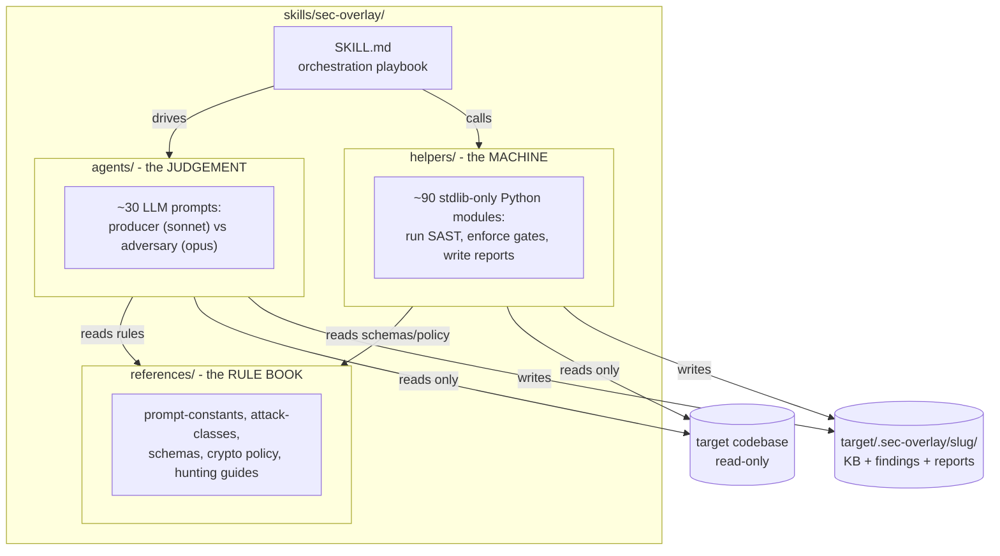

# sec-overlay overview

`sec-overlay` is the one plugin this marketplace distributes: a self-contained,
**agentic security-audit harness**. Point it at a codebase and it finds *actually-exploitable*
vulnerabilities, then hands a security engineer artifacts they can act on: a threat model,
per-finding evidence, a SARIF file, a Markdown report, and a manual runtime-test plan. It calls
binary tools directly (no other Claude Code skills or plugins) and **never executes the
scanned code**.

The core idea, in the skill's own words: *run cheap mechanical tools to find candidates, use
LLM agents to investigate whether each candidate is real, and never let an LLM's opinion alone
confirm a finding — a mechanical tool receipt is always required.*

## Four principles

The skill's [`SKILL.md`](/plugins/sec-overlay/skills/sec-overlay/SKILL.md) states four rules
that govern every phase:

1. **Adversarial-review all things.** Every phase that produces findings, or analysis/context a
   later phase consumes, is battle-tested by an independent adversary before its output is
   handed forward. Findings use the false-positive ladder described in
   [agents](agents.md#the-pipeline-as-prompts) (critic + adversarial-validate); analysis/context
   phases use the [phase-adversary gate](pipeline.md#the-phase-adversary-gate).
2. **Create accurate context.** Repo docs, prior scans, recon, architecture, and threat model
   are verified against code and battle-tested before they drive anything. Inaccurate context
   is a defect caught early, never propagated (see
   [context ingestion](pipeline.md#context-ingestion-and-postflight-c1c2)).
3. **Signal over noise.** Deterministic-first gating, [tool-receipt-only confirmation](helpers.md#the-tool-receipt-gate),
   and a high-confidence bar for the runtime plan keep false positives out of what a human acts on.
4. **Thoroughly review a codebase.** Coverage is pursued until a phase can defend it to its
   adversary; gaps are logged, never silently dropped. Two concrete mechanisms back this: the
   investigate saturation loop (waves stop only at `K=2` consecutive no-new-fingerprint rounds
   or a hard `max_waves=5` cap — see [pipeline](pipeline.md#the-full-phase-order)), and
   `partition.py`'s `unrouted_candidate_classes` safety net, which catches any attack class
   recon didn't explicitly plan for and routes it to a general-triage agent rather than
   dropping it (see [helpers](helpers.md#module-map-grouped-by-job)).

## Three folders, three jobs

*Three cooperating layers: `references/` is the stated-once rule book, `agents/` are the LLM
prompts that judge, and `helpers/` is the deterministic machine that runs tools and enforces
gates no LLM is trusted to enforce.*

- **[`references/`](references.md)** is the harness's library of facts, stated once and obeyed
  everywhere — severity bands, scope rules, JSON schemas, crypto allow/deny lists, and deep
  hunting guides.
- **[`agents/`](agents.md)** are the LLM prompts. Producers (Sonnet) find things; adversaries
  (Opus, a different model family) try to prove them wrong.
- **[`helpers/`](helpers.md)** is the deterministic Python that runs the tools and enforces the
  gates no LLM is trusted to enforce. Stdlib-only — no runtime dependencies.

The main agent driving [`SKILL.md`](/plugins/sec-overlay/skills/sec-overlay/SKILL.md) is the
orchestrator: it calls a Python step, spawns an agent, records the phase, calls the next Python
step. See [pipeline](pipeline.md) for the full phase-by-phase flow, and
[running an audit](running-an-audit.md) for the exact commands.

A fourth, plugin-root folder, [`commands/`](/plugins/sec-overlay/commands/), holds the
`/sec-overlay:audit` slash command — a thin routing document over the same `skills/sec-overlay/`
machinery (`sec_overlay.run.drive` for a single repo, `sec_overlay.correlate` for several). It
carries no logic of its own; see [running an audit](running-an-audit.md#the-driven-audit-sec-overlayaudit).

## The four invariants

These hold everywhere and are enforced in code where possible, in prompts otherwise:

1. **Never executes or modifies the reviewed source.** Static analysis only. Patches are
   applied to a *throwaway copy* to verify them (see `verify.py` in [helpers](helpers.md))
   — the repo's own files are never run or edited. See
   [running an audit](running-an-audit.md#the-do-not-execute-the-target-invariant) for how this
   holds end to end, including the red-team plan.
2. **Writes only its own sidecar.** All output lives in an in-repo, self-ignoring
   `<target>/.sec-overlay/<slug>/` directory (override the base with `$SEC_OVERLAY_HOME`, or the
   whole workspace with `--workspace`). A seeded `.sec-overlay/.gitignore` keeps output out of
   the reviewed repo's git tree.
3. **Tool-receipt gate, tiered.** A finding reaches `confirmed`/`fixed` only with at least one
   **Tier-1** mechanical receipt (`codeql` / `semgrep` / `sca` / `secrets`) — Tier-2 receipts
   (`ripgrep` / `structural-index` / `ast-grep` / `tree-sitter`) locate code but no longer
   confirm alone. LLM reasoning is namespaced `llm-claimed:` and can corroborate but **never**
   confirm. Enforced in
   [`helpers/sec_overlay/findings_gate.py`](helpers.md#the-tool-receipt-gate).
4. **Signal over noise.** Every load-bearing claim made by a Sonnet "producer" is attacked by
   an Opus "adversary" on a different model family; a false-positive ladder plus a
   `needs-deployment-testing` verdict for bugs unprovable from source keep the report clean.
   See [agents](agents.md#producer-vs-adversary).

## The output workspace

Everything a security engineer receives lands in `<target>/.sec-overlay/<slug>/`:

| Path | Contents |
|---|---|
| `kb/scan-profile.json` | recon output: languages, frameworks, `attack_surface`, `sast_plan`, `subsystems` |
| `architecture/` | C4 diagrams (context/container/component) + `runtime-view/` sequences + `arc42.md` — replaces the old `kb/architecture.md` + `kb/entities/*.md` |
| `threat-model/` | `dfd.mmd` (derived from the container diagram) + `attack-sequences/` + `threat-model.md` (STRIDE findings, CVSS v4.0, prioritized hunt list) — replaces the old `kb/THREAT_MODEL.md` |
| `kb/context.json` | the repo's own docs distilled, trust-tagged (`untrusted-doc` / `prior-scan`) |
| `kb/graph.json` | the Tier-1/Tier-2 code graph (reachability substrate) |
| `kb/gates/<phase>.json` | adversary verdict audit trail per gated phase (recon/architecture/threat-model/context) |
| `kb/gates/arch-gate.json`, `tm-gate.json` | deterministic diagram-cap/prose/duplication gates for architecture and threat-model, run before the opus phase-adversary sees them |
| `kb/gates/artifact-gate.json`, `artifact-review.json` | deterministic self-check + opus adversary verdict on the rendered report itself (§4.8) |
| `kb/coverage-ledger.json` | surface-completeness ledger; blocks `complete` while gaps remain |
| `kb/discovery-ledger.json` | investigate saturation state (waves, `terminal_reason`) |
| `findings/<id>.json` + `findings/<id>.md` | every finding, all statuses — evidence, reachability, CVSS v4.0, patch diff, plus a rendered per-finding detail file |
| `report.sarif` | SARIF 2.1.0 (confirmed/fixed, plus suppressed needs-deployment-testing by default) |
| `report.md` | short risk-ordered report linking to `findings/<id>.md` detail files and `redteam-plan.md` |
| `redteam-plan.md` | manual runtime test plan — the engineer's follow-up |
| `state.json` | campaign state (pass number, pinned SHA, stages, per-phase timings) |
| `MEMORY.md`, `learnings/` | durable per-repo memory across runs |

This layout is the `Workspace` dataclass's contract (`helpers/sec_overlay/workspace.py`,
described in [helpers](helpers.md)) and the skill `CLAUDE.md`'s §4. A driven run
(`sec_overlay.run.drive`, see [running an audit](running-an-audit.md#the-driven-audit-sec-overlayaudit))
adds `run.env` (resolved template tokens) and `kb/receipts/<phase>.json` (one receipt per phase,
proving it ran even when it printed nothing).

## Related pages

- [Pipeline](pipeline.md) — the full phase order with a grounded flowchart.
- [Agents](agents.md) — every LLM prompt, its model tier, and the investigate gate ladder.
- [Helpers](helpers.md) — the Python core, module map, and CLI-callable list.
- [References](references.md) — the rule book: prompt constants, schemas, crypto policy.
- [Running an audit](running-an-audit.md) — the smoke scan, the driven `/sec-overlay:audit`
  command, and the full manual agentic audit.
- [Developing the skill](developing-the-skill.md) — tests, linting, and the dev-only bench harness.
- [Cross-repo correlation](cross-repo-correlation.md) — the optional multi-repo capability.
