# sec-overlay audit pipeline

One audit pass runs a fixed phase order. Two ways to drive it exist side by side:

1. **Manually, following [`SKILL.md`](/plugins/sec-overlay/skills/sec-overlay/SKILL.md)** —
   the main agent runs a deterministic Python step (`uv run python -m sec_overlay.<module>`
   from `skills/sec-overlay/helpers/`), spawns an agent with the named `agents/*.md` prompt
   (substituting `{{TARGET}}`/`{{WORKSPACE}}`/`{{ATTACK_CLASS}}`/…), and calls
   `record_stage(<WS>, "<phase>")` itself after each step. This is the full narrative phase
   list below, including three phases the newer driver does not yet automate.
2. **Through the `/sec-overlay:audit` command**, which calls `sec_overlay.run.drive()` — a
   sequencer that walks `sec_overlay.phases.PHASE_TABLE` automatically for every
   deterministic phase and stops to print a "NEXT AGENT PHASE" block for every agent phase.
   See [driver and PHASE_TABLE](#the-driver-and-phase_table-the-newer-auto-sequencer) below
   for exactly which phases this covers.

Either way, a phase is only "done" when all its declared outputs exist **and**
`record_stage` ran — never inferred from one file's presence, so an interrupted run resumes
correctly.

## The full phase order (manual / `SKILL.md` narrative)

```mermaid
flowchart TD
    P0["0 preflight<br/>tools + CodeQL packs present?"] --> P1["1 begin_pass<br/>pin SHA"]
    P1 --> C1(("C1 context-ingest to context-adversary<br/>repo docs as UNTRUSTED"))
    C1 --> T1["T1 graph build<br/>Tier-1 substrate, LLM-free"]
    T1 --> R0["R0 route-census<br/>code-derived route inventory"]
    R0 --> RA(("2 recon<br/>gated by phase-adversary + recall-adversary"))
    RA --> RG["2.5 recall-gate<br/>records unmentioned census routes/catalog classes"]
    RG --> AR(("3-4 architecture to threat-model<br/>each gated by phase-adversary + arch/tm-gate"))
    AR --> TUNE["0.5 tune-config, optional<br/>ratcheted rule/exclusion loop"]
    TUNE --> PRE["5 prefilter<br/>semgrep+codeql+sca+secrets, never-silent"]
    PRE --> INV(("6 investigate<br/>parallel per class, loop-until-dry"))
    INV --> DED["7 dedupe<br/>refactor-resistant fingerprint"]
    DED --> CLUS["7.5 cluster<br/>3+ same-class/sink to systemic cluster"]
    CLUS --> LAD(("8-9 critic to judge to validate to trace<br/>opus refutes; trace sets reachability"))
    LAD --> CAL["10 calibrate<br/>risk_score 1-10, CVSS v4.0"]
    CAL --> PAT(("11 patch, opus, to validate-fix"))
    PAT --> VER["12 verify<br/>apply patch to COPY, re-scan"]
    VER --> GATE["13 findings_gate"]
    GATE --> REP["14 report<br/>report.sarif + report.md"]
    REP --> SS["14.2 selfscore<br/>per-run finding-status score"]
    SS --> RT(("14.4 redteam to redteam-adversary"))
    RT --> AGATE["14.5 artifact-gate<br/>deterministic report self-check"]
    AGATE --> AREV(("14.6 artifact-review, opus<br/>claim<->evidence over the rendered report"))
    AREV --> POST["15 postflight<br/>durable prior_context.json"]
```


*One audit pass, deterministic Python steps as rectangles, agent-driven phases as rounded
nodes. Grounded in `SKILL.md`'s phase sections and the skill `CLAUDE.md` §2 phase-order
table.*

| # | Phase | Runs | Writes |
|---|---|---|---|
| 0 | Preflight | `sec_overlay.preflight` | reports which SAST binaries + CodeQL query packs are installed |
| 1 | Begin pass | `sec_overlay.state.begin_pass(ws, sha)` | pins the SHA, increments the pass counter |
| C1 | Context-ingest | `agents/context-ingest.md` (sonnet) → `agents/context-adversary.md` (opus) | `kb/context.json` |
| T1 | Tier-1 substrate | `sec_overlay.graph build` (no LLM) | `kb/graph.json` v1 — structural index + regex call-edge heuristic + OSV/secrets/crypto facts |
| R0 | Route census | driver phase `route-census` (no LLM) | `kb/route-census.json` — a code-derived route inventory via `references/route-frameworks.json`, never from recon's own output |
| 2 | Recon | `agents/recon.md` (sonnet) → phase-adversary gate → `agents/recall-adversary.md` (opus, recon only) | `kb/scan-profile.json` |
| 2.5 | Recall gate | driver phase `recall-gate` (no LLM) | records every census route / dependency-sink-catalog class recon never named into `kb/coverage-ledger.json`, demoting `completeness` to `partial` |
| 3 | Architecture | `agents/architecture.md` (sonnet) → phase-adversary gate → arch-gate | `architecture/` tree (`arc42.md`, C4 diagrams) |
| 3.5 | Arch gate | `sec_overlay.diagram_gate` + `ste_lint` (no LLM) | `kb/gates/arch-gate.json`; halts the run on a cap/prose/derivation violation |
| 4 | Threat model | `agents/threat-model.md` (sonnet) → phase-adversary gate → tm-gate | `threat-model/` tree (`threat-model.md`, `dfd.mmd`) |
| 4.5 | TM gate | diagram gate + `ste_lint` + duplication check vs. `arc42.md` (no LLM) | `kb/gates/tm-gate.json` |
| 0.5 | Tune (optional) | `agents/tune-config.md`, ratcheted loop, ≤3 rounds | `kb/tuning/round_k/`, merged `sast_plan`/exclusions |
| 5 | Prefilter | `sec_overlay.prefilter.run_prefilter` (no LLM) | candidate findings via semgrep+codeql+sca+secrets, run concurrently |
| 6 | Investigate | `agents/investigate.md` (sonnet, parallel per attack class) | `raw` / `rejected` findings; loops until saturated or capped |
| 7 | Dedupe | `sec_overlay.dedupe` (no LLM) | merges exact collisions, stamps refactor-resistant fingerprint |
| 7.5 | Cluster | `sec_overlay.cluster` (no LLM) | groups ≥3 same-class/sink `raw` findings into one systemic cluster |
| 8-9 | Critic → Judge → Validate → Trace | `agents/critic.md` (sonnet) → `agents/judge.md` (cheap, tool-free) → `agents/validate.md` (opus, different family) → `agents/trace.md` (opus, reachability) | `confirmed` / `rejected`; `reachability` verdict |
| 10 | Calibrate | `sec_overlay.calibrate` (no LLM) | `risk_score` 1-10 from a CVSS v4.0 base vector |
| 11 | Patch → Validate-fix | `agents/patch.md` (opus) → `agents/validate-fix.md` (opus, architect + pentester personas) | `patch_diff` on a throwaway copy |
| 12 | Verify | `sec_overlay.verify` (no LLM) | applies the patch to a temp copy, re-scans, sets `fixed`/`static-only`/`not-fixed` |
| 13 | Gate | `sec_overlay.findings_gate` (no LLM) | schema + tool-receipt validation |
| 14 | Report | `sec_overlay.report` (no LLM) | `report.sarif` + `report.md` |
| 14.2 | Selfscore | `sec_overlay.selfscore` (no LLM) | post-gate finding-status counts written to `state.json` `budget.self_score` |
| 14.4 | Red team | `agents/redteam.md` (sonnet) → `agents/redteam-adversary.md` (opus); `sec_overlay.redteam` (no LLM) | `redteam-plan.md` |
| 14.5 | Artifact gate | `sec_overlay.artifact_gate` (no LLM) | `kb/gates/artifact-gate.json`; hard-requires `redteam-plan.md` to exist |
| 14.6 | Artifact review | `agents/artifact-review.md` (opus, different family) | `kb/gates/artifact-review.json` — claim↔evidence over the *rendered* report; can demote severity, flag `render_stale`, or add `open_questions`, never delete a receipt-backed finding |
| 15 | Postflight | `sec_overlay.postflight` (no LLM) | durable `kb/prior_context.json` |

See [running an audit](running-an-audit.md) for the exact commands and the quick deterministic
smoke-scan alternative (phases 0/5/14 only, no agents).

## The driver and PHASE_TABLE, the newer auto-sequencer

`sec_overlay.phases.PHASE_TABLE` is an ordered tuple of `PhaseSpec`s (name, `deterministic`
or `agent`, input/output artifact paths, and — for agent phases — the prompt file) that
`sec_overlay.driver.run_audit` walks automatically. It backs the
[`/sec-overlay:audit`](/plugins/sec-overlay/commands/audit.md) slash command via
`sec_overlay.run.drive(target, config)`: for a `deterministic` phase whose inputs already
exist it runs the phase, fences the working tree against the pass baseline, writes a receipt
under `kb/receipts/<phase>.json`, and calls `record_stage` automatically; for an `agent` phase
it halts and prints a "NEXT AGENT PHASE" dispatch block, and the orchestrator closes that
phase by calling `sec_overlay.run.advance(target, phase)` after running the named agent, then
re-invokes `drive` to continue. Resume is stage-based: `drive` picks up at the first phase not
yet recorded `done`.

`PHASE_TABLE` currently covers `route-census → recon → recall-gate → architecture → arch-gate
→ threat_model → tm-gate → prefilter → investigate → findings-gate → dedupe → critic → judge →
validate → trace → factcheck → calibrate → patch → verify → demote-noise → report → selfscore
→ redteam → artifact-gate → artifact-review → postflight` (`helpers/sec_overlay/phases.py`).
**Preflight, `begin_pass`, context-ingest (C1), the Tier-1 graph substrate, and the optional
tuning loop (0.5) are not yet phases in this table** — `drive()` runs `begin_pass` itself
internally, but the other three still require the main agent to run them manually per
`SKILL.md` before or around a `drive()`-driven run, exactly as in the narrative order above.
Treat this as the current automation boundary, not a claim that those phases were removed.

## The phase-adversary gate

The false-positive ladder (§8-9 above) already battle-tests investigate findings. The
**earlier** analysis/context phases — recon, architecture, threat-model, and C1 context — each
end with a reusable phase gate so their output is trusted only after an independent challenge:

```
phase output -> deterministic pre-check (sec_overlay.phase_gate.run_phase_checks)
                  cited code ref does not resolve / malformed -> REJECT, no agent, log reason
                  resolves / can't-settle -> independent adversary (agents/phase-adversary.md,
                                             opus, DIFFERENT family, fresh context)
                only battle-tested claims flow forward -> kb/gates/<phase>.json
```

The deterministic pre-check builds claims as `{"id", "refs": [file or file:line, ...]}` — using
`sec_overlay.phase_gate.claims_from_profile(profile)` / `claims_from_context(ctx)` rather than
hand-rolled dicts — and runs `run_phase_checks(claims, <T>)`; a hard-unresolvable ref is
rejected with **no agent call at all**. `phase_gate.py` also flags a comment-only `file:line`
citation via `is_comment_line()` as a gate note (skipping prose files like `.md`/`.rst`/`.txt`,
since every Markdown heading would otherwise read as a comment) — a separate, additive check
from the basename-fallback note. Survivors go to `agents/phase-adversary.md` with
`{{PHASE}}` set to `recon`/`architecture`/`threat-model`/`context`; its INVALIDATED/WEAKENED
verdicts are applied back to the phase artifact and recorded with `build_gate_record` /
`write_gate_record` into `kb/gates/<phase>.json`. Same independence guard as `validate.md`:
opus, a different model family than the sonnet producer.

**Recon carries one extra adversary.** After recon's own phase-adversary pass,
`agents/recall-adversary.md` (opus, fresh context) judges what recon **left out**, never what
it claimed — reading `sec_overlay.phase_gate.recall_claims(ws, profile, target_root=<T>)` plus
`kb/route-census.json`. Its rows have no matching input claim by construction, so they never
appear in `phase-adversary.md`'s count-invariant verdict tables. The deterministic
**recall-gate** phase (run right after recon, before the adversary) independently recomputes
the same census/catalog checks and writes each gap it finds into `kb/coverage-ledger.json`
through `route_control.record_route_gaps`, demoting `completeness` to `partial` — a
deterministic omission therefore cannot be lost by the audit reporting `complete`. An
adversary-only `OMISSION` row has no automatic route into the ledger; a reviewer must record
it by hand as follow-up work.

## Architecture/threat-model gates (arch-gate, tm-gate)

`architecture.md` and `threat-model.md` now produce standards-based artifact trees instead of
a single Markdown file — C4 diagrams + `arc42.md` (architecture; contract in
`references/architecture-standards.md`), and a derived `dfd.mmd` + STRIDE `threat-model.md`
(threat model; contract in `references/threat-model-standards.md`). Each tree is checked by a
**deterministic** gate before the pipeline continues: `sec_overlay.diagram_gate.run_diagram_gate`
enforces per-diagram-kind node/participant/message caps, label word limits, trust-boundary
subgraphs, derivation provenance (a derived diagram cites its source file and a matching
sha256), and no orphan-detail nodes (mirrored from `references/mermaid-caps.md`, kept in sync
by `tests/test_references_caps.py`); `sec_overlay.ste_lint.lint_prose` checks the structural
subset of ASD-STE100 (sentence length, semicolons, paragraph size). The tm-gate additionally
runs `artifact_gate.check_duplication` — a threat-model heading that restates an arc42 heading
is a gate failure, since threat-model must reference architecture by section, never repeat it.
Both halt the pipeline on a cap/prose/derivation violation; the producer re-scopes
(group → split → promote) and regenerates once.

## `scan_options` knobs

Four knobs in `scan_options` let the orchestrator tune cost, coverage, and fan-out. Two carry
hard invariants that are **not** knobs:

- **`adversary_depth`** — `full` (default) runs the opus phase-adversary after every phase
  gate; `gate-by-exception` skips it when a phase adds no material new claims beyond context
  already adversarially validated. **Hard rule:** this only controls which phase-adversary
  invocations fire — it never lets a *finding* reach `confirmed` without a mechanical tool
  receipt. The finding-side FP ladder always runs at full strength regardless of this knob.
- **`model_tier_map`** — phase-to-model-tier overrides (default: sonnet for
  recon/architecture/threat-model/context-ingest/investigate/critic/redteam; opus for
  adversarial-validate/patch/phase-adversary/redteam-adversary/context-adversary). **Hard
  invariant — model-family diversity:** the adversarial validator must be a different, stronger
  model family than the sonnet producer. If an override would collapse finder and validator into
  the same family, the harness must detect it, fall back to a fresh-context validator, and log
  the degradation in `state.json` — never let the finder be the sole confirmer.
- **`wave_k` / `max_waves`** — override the investigate saturation parameters (`K=2` consecutive
  no-new-fingerprint waves = saturated; `max_waves=5` hard cap). Raising `wave_k` trades more
  investigate round-trips for recall; lowering `max_waves` tightens the token ceiling.
- **`token_budget`** — a soft per-scan output-token target that scales investigate fan-out
  width and gates whether the optional adaptive tuning loop (Phase 0.5) runs; it is a steering
  heuristic, not a hard abort, and a finding already in flight is never dropped mid-run.

## Multi-pass campaigns

The full pipeline above is one **pass**; a campaign repeats passes over one persistent
workspace. Each pass: `begin_pass(ws, sha)` pins the current SHA and increments `pass_number`
if the prior pass recorded stages; the phases run and each records completion; the pass ends
with `pass_report` (a state + findings-by-status summary).

On pass N>1 (incremental), the orchestrator scopes to changed code —
`diffscope.changed_files(<prior_sha>, "HEAD")` — and carries settled findings forward with a
drift re-check via `campaign.carry_forward`: settled findings (`confirmed`/`fixed`/`rejected`)
on **changed** files become `stale` and are re-examined; those on **unchanged** files are kept
as-is. The campaign never re-litigates a stable conclusion but always re-checks code that
moved. A full re-scan (pass-1 semantics every pass) remains the safe default; incremental
scoping is the token-saving optimization.

## Context ingestion and postflight (C1/C2)

The harness reads the repo's own security context and its own prior scans, while treating repo
docs strictly as **untrusted claims** — a doc never confirms a finding and never suppresses one,
it only produces leads to verify against code.

- **C1 context-ingest** runs after preflight, before recon, so its leads can feed recon's
  `attack_surface` (an attack-surface class may be added from a lead only if a code indicator
  also exists — docs never inflate scope alone). `agents/context-ingest.md` (sonnet, read-only)
  discovers context docs (`sec_overlay.context.discover_context_files` — `docs/`, `openspec/`,
  ADRs, `SECURITY*`, runbooks, `*-review*.md`, `test-findings*`, and IaC/deployment-config files
  such as Terraform/Helm/k8s/docker-compose, tagged `deployed_in`) and the prior scan's
  `kb/prior_context.json`, trust-tagging every item (`untrusted-doc` / `prior-scan`). For each
  claimed control it sets `verify_status` (`PRESENT`/`MISSING`/`BYPASSABLE`) against code;
  MISSING/BYPASSABLE controls become `CTL-####` candidate findings (evidence
  `llm-claimed:doc-claim`, so a doc claim alone cannot confirm them). `agents/context-adversary.md`
  (opus) then pressure-checks that verification — including a diagram-consistency check against
  `CONTEXT.md`'s claimed-control status diagram — before any later phase consumes it.
- **C2 postflight** runs after artifact-review (the final phase): `sec_overlay.postflight`
  distills settled results into the durable `kb/prior_context.json` (confirmed findings,
  rejected-with-rationale so they are not re-litigated, drift-keyed by SHA) for the *next*
  scan's C1 to read as higher-trust prior context (still drift-checked).

## A separate, lighter pipeline: diff-scoped review

Everything above is the full audit. `sec-overlay review` is a distinct, lighter track over one
diff — not a numbered stage of this phase order and not (yet) wired into `PHASE_TABLE`. See
[diff-review](diff-review.md) for its own producer/filter prompts, profiles, and CI wiring.

## Cross-repo correlation is a separate capability

Cross-repo correlation (`helpers/sec_overlay/correlate/`) is an optional, opt-in, multi-repo
capability that runs **after** N independent per-repo campaigns like the one above already
exist — it is not a numbered stage of this single-repo phase order. The
[`/sec-overlay:audit`](/plugins/sec-overlay/commands/audit.md) command can drive it directly
for two or more repo arguments. See [cross-repo correlation](cross-repo-correlation.md) for its
own workspace, edge model, and producer/adversary pair.

## Related pages

- [Running an audit](running-an-audit.md) — the exact commands for each phase, the smoke-scan
  path, and environment prerequisites.
- [Diff-review](diff-review.md) — the separate, lighter PR-scoped pipeline.
- [Agents](agents.md) — every prompt named above, its model tier, and the investigate gate
  ladder.
- [Helpers](helpers.md) — the deterministic modules that implement every non-agent step.
- [Cross-repo correlation](cross-repo-correlation.md) — the multi-repo capability noted above.
