# sec-overlay audit pipeline

One audit pass runs a fixed phase order, driven by the main agent following
[`SKILL.md`](/plugins/sec-overlay/skills/sec-overlay/SKILL.md) (the full playbook; this page is
the map). Deterministic steps run `uv run python -m sec_overlay.<module>` from
`skills/sec-overlay/helpers/`; agent steps spawn a subagent with the named `agents/*.md` prompt,
substituting tokens like `{{TARGET}}`/`{{WORKSPACE}}`/`{{ATTACK_CLASS}}`. Every phase is recorded
with `record_stage(<WS>, "<phase>")` so an interrupted run can resume — a phase is only "done"
when all its outputs exist **and** `record_stage` ran, never inferred from one file's presence.
A newer, partly-automated invocation path (`sec_overlay.run.drive`/`advance`, behind the
`/sec-overlay:audit` command) walks a subset of this phase order for you — see
[running an audit](running-an-audit.md#the-driven-audit-sec-overlayaudit) and the scope note below.

## The full phase order

```mermaid
flowchart TD
    P0["0 preflight<br/>tools + CodeQL packs present?"] --> P1["1 begin_pass<br/>pin SHA"]
    P1 --> C1(("C1 context-ingest to context-adversary<br/>repo docs as UNTRUSTED"))
    C1 --> T1["T1 graph build<br/>Tier-1 substrate, LLM-free"]
    T1 --> RECON(("2 recon<br/>gated by phase-adversary"))
    RECON --> ARCH(("3 architecture<br/>C4 + arc42 tree"))
    ARCH --> AGATE["3.5 arch-gate<br/>diagram_gate + ste_lint, deterministic"]
    AGATE --> TM(("4 threat-model<br/>DFD + STRIDE tree"))
    TM --> TGATE["4.5 tm-gate<br/>diagram_gate + ste_lint + duplication check"]
    TGATE --> TUNE["0.5 tune-config, optional<br/>ratcheted rule/exclusion loop"]
    TUNE --> PRE["5 prefilter<br/>semgrep+codeql+sca+secrets, never-silent"]
    PRE --> INV(("6 investigate<br/>parallel per class, loop-until-dry"))
    INV --> DED["7 dedupe<br/>refactor-resistant fingerprint"]
    DED --> CLUS["7.5 cluster<br/>3+ same-class/sink to systemic cluster"]
    CLUS --> LAD(("8-9 critic to judge to validate, opus refutes"))
    LAD --> CAL["10 calibrate<br/>risk_score 1-10, CVSS v4.0"]
    CAL --> PAT(("11 patch, opus, to validate-fix"))
    PAT --> VER["12 verify<br/>apply patch to COPY, re-scan"]
    VER --> GATE["13 findings_gate<br/>tiered tool-receipt check"]
    GATE --> RT(("13.5 redteam to redteam-adversary"))
    RT --> RTR["redteam.py renders redteam-plan.md"]
    RTR --> REP["14 report<br/>report.sarif + report.md + one file per finding"]
    REP --> AGATE2["14.5 artifact-gate<br/>deterministic self-check"]
    AGATE2 --> AREV(("14.6 artifact-review<br/>opus, claim-to-evidence"))
    AREV --> C2["C2 postflight<br/>durable prior_context.json"]
    C2 --> SS["selfscore<br/>per-run finding-status score"]
```


*One audit pass, deterministic Python steps as rectangles, agent-driven phases as rounded
nodes. Grounded in `SKILL.md`'s numbered phase list and the skill `CLAUDE.md` §2 phase-order
table.*

| # | Phase | Runs | Writes |
|---|---|---|---|
| 0 | Preflight | `sec_overlay.preflight` | reports which SAST binaries + CodeQL query packs are installed |
| 1 | Begin pass | `sec_overlay.state.begin_pass(ws, sha)` | pins the SHA, increments the pass counter |
| C1 | Context-ingest | `agents/context-ingest.md` (sonnet) → `agents/context-adversary.md` (opus) | `kb/context.json` |
| T1 | Tier-1 substrate | `sec_overlay.graph build` (no LLM) | `kb/graph.json` v1 — structural index + regex call-edge heuristic + OSV/secrets/crypto facts |
| 2 | Recon | `agents/recon.md` (sonnet) → `agents/phase-adversary.md` (opus) | `kb/scan-profile.json` |
| 3 | Architecture | `agents/architecture.md` (sonnet) | `architecture/` tree — C4 diagrams + `arc42.md` (replaces the old `kb/architecture.md`/`kb/entities/`) |
| 3.5 | Arch gate | `sec_overlay.diagram_gate` + `sec_overlay.ste_lint` (no LLM) | `kb/gates/arch-gate.json`; halts the run on a cap/prose/missing-limitation-statement violation |
| 4 | Threat model | `agents/threat-model.md` (sonnet) | `threat-model/` tree — derived `dfd.mmd`, `attack-sequences/`, `threat-model.md` (STRIDE + CVSS v4.0 findings table + hunt list); replaces the old `kb/THREAT_MODEL.md` |
| 4.5 | TM gate | `sec_overlay.diagram_gate` + `ste_lint` + `artifact_gate.check_duplication` (no LLM) | `kb/gates/tm-gate.json`; also rejects a threat-model heading that restates arc42 structure |
| — | Phase-adversary (architecture, threat-model, context) | `agents/phase-adversary.md` (opus) | `kb/gates/<phase>.json` — re-derives each claim from code, independent of the deterministic gates above |
| 0.5 | Tune (optional) | `agents/tune-config.md`, ratcheted loop, ≤3 rounds | `kb/tuning/round_k/`, merged `sast_plan`/exclusions |
| 5 | Prefilter | `sec_overlay.prefilter.run_prefilter` (no LLM) | candidate findings via semgrep+codeql+sca+secrets, run concurrently |
| 6 | Investigate | `agents/investigate.md` (sonnet, parallel per attack class) | `raw` / `rejected` findings; loops until saturated or capped |
| 7 | Dedupe | `sec_overlay.dedupe` (no LLM) | merges exact collisions, stamps refactor-resistant fingerprint |
| 7.5 | Cluster | `sec_overlay.cluster` (no LLM) | groups ≥3 same-class/sink `raw` findings into one systemic cluster |
| 8-9 | Critic → Judge → Validate | `agents/critic.md` (sonnet) → `agents/judge.md` (cheap, tool-free) → `agents/validate.md` (opus, different family) | `confirmed` / `rejected`; confirming now requires a real CVSS v4.0 `cvss_vector` + non-empty `preconditions` |
| 10 | Calibrate | `sec_overlay.calibrate` (no LLM) | `risk_score` 1-10 from the CVSS v4.0 vector (`sec_overlay.cvss.cvss40_base`); also promotes `runtime_dependent` raw findings to `needs-deployment-testing` |
| 11 | Patch → Validate-fix | `agents/patch.md` (opus) → `agents/validate-fix.md` (opus, architect + pentester personas) | `patch_diff` on a throwaway copy |
| 12 | Verify | `sec_overlay.verify` (no LLM) | applies the patch to a temp copy, re-scans, sets `fixed`/`static-only`/`not-fixed` |
| 13 | Gate | `sec_overlay.findings_gate` (no LLM) | schema + **tiered** tool-receipt validation (see [helpers](helpers.md#the-tool-receipt-gate)) |
| 13.5 | Red team | `agents/redteam.md` (sonnet) → `agents/redteam-adversary.md` (opus); `sec_overlay.redteam` (no LLM) | `redteam-plan.md` |
| 14 | Report | `sec_overlay.report` (no LLM) | `report.sarif` + short `report.md` + one `findings/<id>.md` detail file per finding |
| 14.5 | Artifact gate | `sec_overlay.artifact_gate.run_artifact_gate` (no LLM) | `kb/gates/artifact-gate.json` — stale-section/triage-cell/context-diagram-cap self-check on the rendered report |
| 14.6 | Artifact review | `agents/artifact-review.md` (opus) | `kb/gates/artifact-review.json` — claim-to-evidence, impact-honesty, and red-team-coverage adversary pass |
| C2 | Postflight | `sec_overlay.postflight` | durable `kb/prior_context.json` |
| — | Selfscore | `sec_overlay.selfscore` | per-run finding-status counts persisted to `state.json` `budget.self_score` |

See [running an audit](running-an-audit.md) for the exact commands and the quick deterministic
smoke-scan alternative (phases 0/5/14 only, no agents).

## The driven subset vs. the full playbook

`helpers/sec_overlay/phases.py`'s `PHASE_TABLE` — walked by `sec_overlay.run.drive`/`advance`
and the `/sec-overlay:audit` command — currently automates `recon` through `artifact-review`
(phases 2 through 14.6 above), including the new `arch-gate`/`tm-gate`/`artifact-gate` rows,
with a fence-and-receipt wrapper around every stage (see
[running an audit](running-an-audit.md#the-driven-audit-sec-overlayaudit)). It does **not** yet
drive preflight, `begin_pass`, C1 context-ingest, T1 graph build, the optional tuning loop,
`redteam`/`redteam-adversary`, or C2 postflight/selfscore — those phases still need the
orchestrator to follow `SKILL.md`'s fuller instructions by hand. Treat the driven path as the
recommended way to run the phases it covers, and `SKILL.md` as authoritative for the full order.

## The phase-adversary gate

The false-positive ladder (§8-9 above) already battle-tests investigate findings. The
**earlier** analysis/context phases — recon, architecture, threat-model, and C1 context — each
end with a reusable phase gate so their output is trusted only after an independent challenge:

```
phase output -> deterministic pre-check (sec_overlay.phase_gate.run_phase_checks)
                  cited code ref does not resolve / malformed -> REJECT, no agent, log reason
                  resolves / can't-settle -> independent adversary (agents/phase-adversary.md,
                                             opus, DIFFERENT family, fresh context)
                only battle-tested claims flow forward -> kb/gates/<phase>.json
```

The deterministic pre-check builds claims as `{"id", "refs": [file or file:line, ...]}` — using
`sec_overlay.phase_gate.claims_from_profile(profile)` / `claims_from_context(ctx)` rather than
hand-rolled dicts — and runs `run_phase_checks(claims, <T>)`; a hard-unresolvable ref is
rejected with **no agent call at all**. `phase_gate.py` also flags a comment-only `file:line`
citation via `is_comment_line()` as a gate note (skipping prose files like `.md`/`.rst`/`.txt`,
since every Markdown heading would otherwise read as a comment) — a separate, additive check
from the basename-fallback note. Survivors go to `agents/phase-adversary.md` with
`{{PHASE}}` set to `recon`/`architecture`/`threat-model`/`context`; its INVALIDATED/WEAKENED
verdicts are applied back to the phase artifact and recorded with `build_gate_record` /
`write_gate_record` into `kb/gates/<phase>.json`. Same independence guard as `validate.md`:
opus, a different model family than the sonnet producer.

This is separate from, and runs alongside, the new **deterministic** `arch-gate`/`tm-gate`
checks (§3.5/4.5 above): `phase_gate.py` checks that a claim's *citation* resolves; `diagram_gate.py`
+ `ste_lint.py` check that the *diagram* obeys `references/mermaid-caps.md`'s caps and the
document's prose obeys the checkable subset of ASD-STE100 (`references/prompt-constants.md`'s
`STE_PROSE` block). Either can halt the run independently of the other.

## `scan_options` knobs

Four knobs in `scan_options` let the orchestrator tune cost, coverage, and fan-out. Two carry
hard invariants that are **not** knobs:

- **`adversary_depth`** — `full` (default) runs the opus phase-adversary after every phase
  gate; `gate-by-exception` skips it when a phase adds no material new claims beyond context
  already adversarially validated. **Hard rule:** this only controls which phase-adversary
  invocations fire — it never lets a *finding* reach `confirmed` without a mechanical tool
  receipt. The finding-side FP ladder always runs at full strength regardless of this knob.
- **`model_tier_map`** — phase-to-model-tier overrides (default: sonnet for
  recon/architecture/threat-model/context-ingest/investigate/critic/redteam; opus for
  adversarial-validate/patch/phase-adversary/redteam-adversary/context-adversary/artifact-review).
  **Hard invariant — model-family diversity:** the adversarial validator must be a different,
  stronger model family than the sonnet producer. If an override would collapse finder and
  validator into the same family, the harness must detect it, fall back to a fresh-context
  validator, and log the degradation in `state.json` — never let the finder be the sole
  confirmer.
- **`wave_k` / `max_waves`** — override the investigate saturation parameters (`K=2` consecutive
  no-new-fingerprint waves = saturated; `max_waves=5` hard cap). Raising `wave_k` trades more
  investigate round-trips for recall; lowering `max_waves` tightens the token ceiling.
- **`token_budget`** — a soft per-scan output-token target that scales investigate fan-out
  width and gates whether the optional adaptive tuning loop (Phase 0.5) runs; it is a steering
  heuristic, not a hard abort, and a finding already in flight is never dropped mid-run.

## Multi-pass campaigns

The full pipeline above is one **pass**; a campaign repeats passes over one persistent
workspace. Each pass: `begin_pass(ws, sha)` pins the current SHA and increments `pass_number`
if the prior pass recorded stages; the phases run and each records completion; the pass ends
with `pass_report` (a state + findings-by-status summary).

On pass N>1 (incremental), the orchestrator scopes to changed code —
`diffscope.changed_files(<prior_sha>, "HEAD")` — and carries settled findings forward with a
drift re-check via `campaign.carry_forward`: settled findings (`confirmed`/`fixed`/`rejected`)
on **changed** files become `stale` and are re-examined; those on **unchanged** files are kept
as-is. The campaign never re-litigates a stable conclusion but always re-checks code that
moved. A full re-scan (pass-1 semantics every pass) remains the safe default; incremental
scoping is the token-saving optimization.

## Context ingestion and postflight (C1/C2)

The harness reads the repo's own security context and its own prior scans, while treating repo
docs strictly as **untrusted claims** — a doc never confirms a finding and never suppresses one,
it only produces leads to verify against code.

- **C1 context-ingest** runs after preflight, before recon, so its leads can feed recon's
  `attack_surface` (an attack-surface class may be added from a lead only if a code indicator
  also exists — docs never inflate scope alone). `agents/context-ingest.md` (sonnet, read-only)
  discovers context docs (`sec_overlay.context.discover_context_files` — `docs/`, `openspec/`,
  ADRs, `SECURITY*`, runbooks, `*-review*.md`, `test-findings*`) and the prior scan's
  `kb/prior_context.json`, trust-tagging every item (`untrusted-doc` / `prior-scan`). For each
  claimed control it sets `verify_status` (`PRESENT`/`MISSING`/`BYPASSABLE`) against code;
  MISSING/BYPASSABLE controls become `CTL-####` candidate findings (evidence
  `llm-claimed:doc-claim`, so a doc claim alone cannot confirm them). `agents/context-adversary.md`
  (opus) then pressure-checks that verification before any later phase consumes it.
- **C2 postflight** runs after report: `sec_overlay.postflight` distills settled results into
  the durable `kb/prior_context.json` (confirmed findings, rejected-with-rationale so they are
  not re-litigated, drift-keyed by SHA) for the *next* scan's C1 to read as higher-trust prior
  context (still drift-checked).

## Cross-repo correlation is a separate capability

Cross-repo correlation (`helpers/sec_overlay/correlate/`) is an optional, opt-in, multi-repo
capability that runs **after** N independent per-repo campaigns like the one above already
exist — it is not a numbered stage of this single-repo phase order. `/sec-overlay:audit <repo>
<repo> ...` drives this end to end: it audits each repo (resuming each from its own recorded
stages), infers each repo's correlation role from its scan profile, and — after operator
confirmation — synthesizes the manifest and calls the same `sec_overlay.correlate` core. See
[cross-repo correlation](cross-repo-correlation.md) for its own workspace, edge model, and
producer/adversary pair, and [running an audit](running-an-audit.md#the-driven-audit-sec-overlayaudit)
for the command.

## Related pages

- [Running an audit](running-an-audit.md) — the exact commands for each phase, the smoke-scan
  path, the driven `/sec-overlay:audit` command, and environment prerequisites.
- [Agents](agents.md) — every prompt named above, its model tier, and the investigate gate
  ladder.
- [Helpers](helpers.md) — the deterministic modules that implement every non-agent step.
- [Cross-repo correlation](cross-repo-correlation.md) — the multi-repo capability noted above.