# sec-overlay audit pipeline

One audit pass runs a fixed phase order, driven by the main agent following
[`SKILL.md`](/plugins/sec-overlay/skills/sec-overlay/SKILL.md) (the full playbook; this page is
the map). Deterministic steps run `uv run python -m sec_overlay.<module>` from
`skills/sec-overlay/helpers/`; agent steps spawn a subagent with the named `agents/*.md` prompt,
substituting tokens like `{{TARGET}}`/`{{WORKSPACE}}`/`{{ATTACK_CLASS}}`. Every phase is recorded
with `record_stage(<WS>, "<phase>")` so an interrupted run can resume — a phase is only "done"
when all its outputs exist **and** `record_stage` ran, never inferred from one file's presence.
A growing tail of the pipeline is now **wired into `phases.py`'s `PHASE_TABLE`** and driven by
`driver.py` rather than only described in prose: `route-census`, `recall-gate`, `arch-gate`,
`tm-gate`, `redteam`, and `postflight` all run as automatic `DETERMINISTIC_ACTIONS`/agent-dispatch
entries the driver walks in order, halting loudly (`PhaseHalt`) on a missing input or output
rather than silently skipping ahead.

## The full phase order

```mermaid
flowchart TD
    P0["0 preflight<br/>tools + CodeQL packs present?"] --> P1["1 begin_pass<br/>pin SHA"]
    P1 --> C1(("C1 context-ingest to context-adversary<br/>repo docs as UNTRUSTED"))
    C1 --> T1["T1 graph build<br/>Tier-1 substrate, LLM-free"]
    T1 --> R0["R0 route-census<br/>code-derived route inventory, LLM-free"]
    R0 --> RA(("2 recon<br/>gated by phase-adversary"))
    RA --> RG(("2.5 recall-gate + recall-adversary<br/>what did recon omit?"))
    RG --> AR(("3 architecture<br/>C4 + arc42, gated by phase-adversary"))
    AR --> AG["3.5 arch-gate<br/>diagram caps + STE prose"]
    AG --> TM(("4 threat-model<br/>DFD + STRIDE, gated by phase-adversary"))
    TM --> TG["4.5 tm-gate<br/>diagram caps + STE prose + duplication"]
    TG --> TUNE["0.5 tune-config, optional<br/>ratcheted rule/exclusion loop"]
    TUNE --> PRE["5 prefilter<br/>semgrep+codeql+sca+secrets, never-silent"]
    PRE --> INV(("6 investigate<br/>parallel per class, loop-until-dry"))
    INV --> DED["7 dedupe<br/>refactor-resistant fingerprint"]
    DED --> CLUS["7.5 cluster<br/>3+ same-class/sink to systemic cluster"]
    CLUS --> LAD(("8-9 critic to judge to validate, opus refutes"))
    LAD --> TR(("trace<br/>reachability verdict"))
    TR --> CAL["10 calibrate<br/>CVSS v4.0 risk_score 1-10 + citations"]
    CAL --> PAT(("11 patch, opus, to validate-fix"))
    PAT --> VER["12 verify<br/>apply patch to COPY, re-scan"]
    VER --> GATE["13 findings_gate"]
    GATE --> REP["14 report<br/>report.sarif + report.md"]
    REP --> SS["14.2 selfscore"]
    SS --> RT(("14.4 redteam to redteam-adversary"))
    RT --> RTR["redteam.py renders redteam-plan.md"]
    RTR --> AGATE["14.5 artifact-gate<br/>deterministic report self-check"]
    AGATE --> AREV(("14.6 artifact-review, opus<br/>claim vs evidence over the rendered report"))
    AREV --> POST["15 postflight<br/>durable prior_context.json"]
```


*One audit pass, deterministic Python steps as rectangles, agent-driven phases as rounded
nodes. Grounded in the skill `CLAUDE.md`'s §2 phase-order table and `SKILL.md`'s numbered
phase list.*

| # | Phase | Runs | Writes |
|---|---|---|---|
| 0 | Preflight | `sec_overlay.preflight` | which SAST binaries + CodeQL query packs are installed |
| 1 | Begin pass | `sec_overlay.state.begin_pass(ws, sha)` | pins the SHA, increments the pass counter |
| C1 | Context-ingest | `agents/context-ingest.md` (sonnet) → `agents/context-adversary.md` (opus) | `kb/context.json` |
| T1 | Tier-1 substrate | `sec_overlay.graph build` (no LLM) | `kb/graph.json` v1 — structural index + regex call-edge heuristic + OSV/secrets/crypto facts |
| R0 | Route census | `sec_overlay.route_census.census` (no LLM), the driver's `route-census` phase | `kb/route-census.json` — a code-derived route inventory read **before** recon, never from recon's own output |
| 2 | Recon | `agents/recon.md` (sonnet) → phase gate (opus `phase-adversary.md`) | `kb/scan-profile.json` (adds `dependency_sinks` from `references/dependency-sinks.json` matches; always plans `rules/absence` for every language) |
| 2.5 | Recall gate | `sec_overlay.phase_gate.recall_claims` + `agents/recall-adversary.md` (opus); driver's `recall-gate` phase | records unmentioned census routes/catalog classes into `kb/coverage-ledger.json` via `route_control.record_route_gaps`, demoting `completeness` to `partial` |
| 3 | Architecture | `agents/architecture.md` (sonnet) → phase gate | `architecture/` tree: C4 diagrams + `runtime-view/` sequences + `arc42.md` (C4 + arc42 standard) |
| 3.5 | Arch gate | `sec_overlay.diagram_gate` + `sec_overlay.ste_lint` (no LLM) | `kb/gates/arch-gate.json`; halts the pipeline on a diagram-cap or STE-prose violation |
| 4 | Threat model | `agents/threat-model.md` (sonnet) → phase gate | `threat-model/` tree: `dfd.mmd` (derived from the container diagram) + `attack-sequences/` + `threat-model.md` (STRIDE + CVSS v4.0 findings table + hunt list) |
| 4.5 | TM gate | diagram gate + STE lint + a duplication check against `arc42.md` (no LLM) | `kb/gates/tm-gate.json`; halts on cap/prose/duplication violation, or a missing `dfd.mmd` |
| 0.5 | Tune (optional) | `agents/tune-config.md`, ratcheted loop, ≤3 rounds | `kb/tuning/round_k/`, merged `sast_plan`/exclusions |
| 5 | Prefilter | `sec_overlay.prefilter.run_prefilter` (no LLM) | candidate findings via semgrep+codeql+sca+secrets, run concurrently |
| 6 | Investigate | `agents/investigate.md` (sonnet, parallel per attack class) | `raw` / `rejected` findings; loops until saturated or capped |
| 7 | Dedupe | `sec_overlay.dedupe` (no LLM) | merges exact collisions, stamps refactor-resistant fingerprint |
| 7.5 | Cluster | `sec_overlay.cluster` (no LLM) | groups ≥3 same-class/sink `raw` findings into one systemic cluster |
| 8-9 | Critic → Judge → Validate | `agents/critic.md` (sonnet) → `agents/judge.md` (cheap, tool-free) → `agents/validate.md` (opus, different family) | `confirmed` / `rejected` |
| — | Trace | `agents/trace.md` (opus) | `reachability` verdict (`static-settled` vs `needs-runtime`, `blocker` taxonomy) and `preconditions` |
| 10 | Calibrate | `sec_overlay.calibrate` (no LLM) | `risk_score` 1-10 from a real CVSS v4.0 vector; also promotes `runtime_dependent` raw findings to `needs-deployment-testing` |
| 11 | Patch → Validate-fix | `agents/patch.md` (opus) → `agents/validate-fix.md` (opus, architect + pentester personas) | `patch_diff` on a throwaway copy |
| 12 | Verify | `sec_overlay.verify` (no LLM) | applies the patch to a temp copy, re-scans, sets `fixed`/`static-only`/`not-fixed` |
| 13 | Gate | `sec_overlay.findings_gate` (no LLM) | schema + tool-receipt validation |
| 14 | Report | `sec_overlay.report` (no LLM) | `report.sarif` + `report.md` |
| 14.2 | Selfscore | `sec_overlay.selfscore` | per-run finding-status counts persisted to `state.json`'s `budget.self_score` |
| 14.4 | Red team | `agents/redteam.md` (sonnet) → `agents/redteam-adversary.md` (opus); `sec_overlay.redteam` (no LLM) | `redteam-plan.md`; PHASE_TABLE-wired — the driver dispatches this automatically after selfscore, before the artifact gate |
| 14.5 | Artifact gate | `sec_overlay.artifact_gate` (no LLM) | deterministic self-check over the rendered report — hard-requires `redteam-plan.md` to exist |
| 14.6 | Artifact review | `agents/artifact-review.md` (opus, different family) | claim↔evidence check over `report.md`/`report.sarif`/`redteam-plan.md`; verdict → `kb/gates/artifact-review.json` |
| 15 | Postflight | `sec_overlay.postflight` | durable `kb/prior_context.json`; PHASE_TABLE-wired as the final automatic phase |

See [running an audit](running-an-audit.md) for the exact commands and the quick deterministic
smoke-scan alternative (phases 0/5/14 only, no agents).

## The phase-adversary gate

The false-positive ladder (§8-9 above) already battle-tests investigate findings. The
**earlier** analysis/context phases — recon, architecture, threat-model, and C1 context — each
end with a reusable phase gate so their output is trusted only after an independent challenge:

```
phase output -> deterministic pre-check (sec_overlay.phase_gate.run_phase_checks)
                  cited code ref does not resolve / malformed -> REJECT, no agent, log reason
                  resolves / can't-settle -> independent adversary (agents/phase-adversary.md,
                                             opus, DIFFERENT family, fresh context)
                only battle-tested claims flow forward -> kb/gates/<phase>.json
```

The deterministic pre-check builds claims as `{"id", "refs": [file or file:line, ...]}` — using
`sec_overlay.phase_gate.claims_from_profile(profile)` / `claims_from_context(ctx)` rather than
hand-rolled dicts — and runs `run_phase_checks(claims, <T>)`; a hard-unresolvable ref is
rejected with **no agent call at all**. Survivors go to `agents/phase-adversary.md` with
`{{PHASE}}` set to `recon`/`architecture`/`threat-model`/`context`; its INVALIDATED/WEAKENED
verdicts are applied back to the phase artifact and recorded with `build_gate_record` /
`write_gate_record` into `kb/gates/<phase>.json`. Same independence guard as `validate.md`:
opus, a different model family than the sonnet producer. It also flags a comment-only
`file:line` citation (`is_comment_line()`) as a note rather than a rejection, since a Markdown
heading would otherwise read as a comment.

## The recall gate and recall adversary (recon only)

Recon gets one extra check the other analysis phases don't: `agents/recall-adversary.md`
(opus, fresh context) judges what recon **left out**, never what it claimed — that split keeps
`phase-adversary.md`'s count-invariant verdict tables intact, since a recall row has no
matching claim by construction. Its inputs are `kb/route-census.json` (§R0 above), the
dependency-sink catalog matches, and `sec_overlay.phase_gate.recall_claims(ws, profile,
target_root=<T>)`. It reports an `OMISSION | <what> | <file:line or manifest path> | <why recon
could miss it>` row per gap it finds, or the single line `NO OMISSION FOUND`; it runs only
after recon's own `phase-adversary.md` pass.

A **separate deterministic phase, `recall-gate`**, runs right after recon regardless of the
adversary. It recomputes the same census and catalog checks and writes each gap into
`kb/coverage-ledger.json` through `route_control.record_route_gaps`, demoting `completeness` to
`partial` — a deterministic omission can never be silently reported as `complete`. An
adversary-only `OMISSION` row has **no** automatic route into the ledger; a reviewer must carry
that one forward by hand.

## `scan_options` knobs

Four knobs in `scan_options` let the orchestrator tune cost, coverage, and fan-out. Two carry
hard invariants that are **not** knobs:

- **`adversary_depth`** — `full` (default) runs the opus phase-adversary after every phase
  gate; `gate-by-exception` skips it when a phase adds no material new claims beyond context
  already adversarially validated. **Hard rule:** this only controls which phase-adversary
  invocations fire — it never lets a *finding* reach `confirmed` without a mechanical tool
  receipt. The finding-side FP ladder always runs at full strength regardless of this knob.
- **`model_tier_map`** — phase-to-model-tier overrides (default: sonnet for
  recon/architecture/threat-model/context-ingest/investigate/critic/redteam; opus for
  adversarial-validate/patch/phase-adversary/redteam-adversary/context-adversary/
  recall-adversary/artifact-review/trace). **Hard invariant — model-family diversity:** the
  adversarial validator must be a different, stronger model family than the sonnet producer.
  If an override would collapse finder and validator into the same family, the harness must
  detect it, fall back to a fresh-context validator, and log the degradation in `state.json` —
  never let the finder be the sole confirmer.
- **`wave_k` / `max_waves`** — override the investigate saturation parameters (`K=2` consecutive
  no-new-fingerprint waves = saturated; `max_waves=5` hard cap). Raising `wave_k` trades more
  investigate round-trips for recall; lowering `max_waves` tightens the token ceiling.
- **`token_budget`** — a soft per-scan output-token target that scales investigate fan-out
  width and gates whether the optional adaptive tuning loop (Phase 0.5) runs; it is a steering
  heuristic, not a hard abort, and a finding already in flight is never dropped mid-run.

## Multi-pass campaigns

The full pipeline above is one **pass**; a campaign repeats passes over one persistent
workspace. Each pass: `begin_pass(ws, sha)` pins the current SHA and increments `pass_number`
if the prior pass recorded stages; the phases run and each records completion; the pass ends
with `pass_report` (a state + findings-by-status summary).

On pass N>1 (incremental), the orchestrator scopes to changed code —
`diffscope.changed_files(<prior_sha>, "HEAD")` — and carries settled findings forward with a
drift re-check via `campaign.carry_forward`: settled findings (`confirmed`/`fixed`/`rejected`)
on **changed** files become `stale` and are re-examined; those on **unchanged** files are kept
as-is. The campaign never re-litigates a stable conclusion but always re-checks code that
moved. A full re-scan (pass-1 semantics every pass) remains the safe default; incremental
scoping is the token-saving optimization.

## Context ingestion and postflight (C1/C2)

The harness reads the repo's own security context and its own prior scans, while treating repo
docs strictly as **untrusted claims** — a doc never confirms a finding and never suppresses one,
it only produces leads to verify against code.

- **C1 context-ingest** runs after preflight, before recon, so its leads can feed recon's
  `attack_surface` (an attack-surface class may be added from a lead only if a code indicator
  also exists — docs never inflate scope alone). `agents/context-ingest.md` (sonnet, read-only)
  discovers context docs (`sec_overlay.context.discover_context_files` — `docs/`, `openspec/`,
  ADRs, `SECURITY*`, runbooks, `*-review*.md`, `test-findings*`, plus IaC/deployment-config
  files it tags `deployment_config`) and the prior scan's `kb/prior_context.json`, trust-tagging
  every item (`untrusted-doc` / `prior-scan`). For each claimed control it sets `verify_status`
  (`PRESENT`/`MISSING`/`BYPASSABLE`) against code; MISSING/BYPASSABLE controls become
  `CTL-####` candidate findings (evidence `llm-claimed:doc-claim`, so a doc claim alone cannot
  confirm them). `agents/context-adversary.md` (opus) then pressure-checks that verification
  before any later phase consumes it.
- **C2 postflight** runs after report: `sec_overlay.postflight` distills settled results into
  the durable `kb/prior_context.json` (confirmed findings, rejected-with-rationale so they are
  not re-litigated, drift-keyed by SHA) for the *next* scan's C1 to read as higher-trust prior
  context (still drift-checked).

## This is one of two tracks — diff-scoped review is the other

Everything above is the **audit** pipeline — a deep, multi-phase campaign over a whole repo.
[Review mode](review-mode.md) (`sec_overlay.cli review`) is a separate, lighter track over one
diff, with its own three/five-step prepare→dispatch→consume loop and no phase driver — it is
what a pull-request CI job actually runs, not a numbered stage of the phase order above.

## Cross-repo correlation is a separate capability

Cross-repo correlation (`helpers/sec_overlay/correlate/`) is an optional, opt-in, multi-repo
capability that runs **after** N independent per-repo campaigns like the one above already
exist — it is not a numbered stage of this single-repo phase order. `/sec-overlay:audit` is the
single front door for both the one-repo and N-repo cases (see
[running an audit](running-an-audit.md#the-sec-overlay-audit-command)). See
[cross-repo correlation](cross-repo-correlation.md) for its own workspace, edge model, and
producer/adversary pair.

## Related pages

- [Running an audit](running-an-audit.md) — the exact commands for each phase, the `/sec-overlay:audit`
  command, and the quick deterministic smoke-scan path.
- [Review mode](review-mode.md) — the diff-scoped CI/PR track, kept separate from this pipeline.
- [Agents](agents.md) — every prompt named above, its model tier, and the investigate gate
  ladder.
- [Helpers](helpers.md) — the deterministic modules that implement every non-agent step.
- [Cross-repo correlation](cross-repo-correlation.md) — the multi-repo capability noted above.
