# sec-overlay audit pipeline

One audit pass runs a fixed phase order, driven by the main agent following
[`SKILL.md`](/plugins/sec-overlay/skills/sec-overlay/SKILL.md) (the full playbook; this page is
the map). Deterministic steps run `uv run python -m sec_overlay.<module>` from
`skills/sec-overlay/helpers/`; agent steps spawn a subagent with the named `agents/*.md` prompt,
substituting tokens like `{{TARGET}}`/`{{WORKSPACE}}`/`{{ATTACK_CLASS}}`. Every phase is recorded
with `record_stage(<WS>, "<phase>")` so an interrupted run can resume — a phase is only "done"
when all its outputs exist **and** `record_stage` ran, never inferred from one file's presence.
`sec_overlay.phases.PHASE_TABLE` is the single ordered source of truth (28 entries); the audit
driver (`sec_overlay.driver`) walks it, and `phase_docs.py --write` regenerates the table below,
the same one in `SKILL.md`, `agents/README.md`, and `helpers/README.md`, from that one source —
never hand-edit any of those four copies.

## The full phase order

```mermaid
flowchart TD
    P0["preflight<br/>tools + CodeQL packs present?"] --> P1["begin_pass<br/>pin SHA"]
    P1 --> C1(("C1 context-ingest to context-adversary<br/>repo docs as UNTRUSTED"))
    C1 --> T1["T1 graph build<br/>Tier-1 substrate, LLM-free"]
    T1 --> RC["route-census<br/>code-derived route inventory"]
    RC --> R(("recon")) --> RG["recall-gate<br/>records unmentioned routes/classes"]
    RG --> AR(("architecture")) --> AG["arch-gate<br/>diagram caps + STE prose"]
    AG --> TM(("threat_model")) --> TG["tm-gate<br/>+ arc42 duplication check"]
    TG -. "each of the three gated by" .-> PA["phase-adversary (opus)"]
    TG --> PRE["prefilter<br/>semgrep+codeql+sca+secrets, never-silent"]
    PRE --> INV(("investigate<br/>parallel per class, loop-until-dry"))
    INV --> FG1["findings-gate"]
    FG1 --> DED["dedupe<br/>refactor-resistant fingerprint"]
    DED --> CLUS["cluster<br/>3+ same-class/sink to systemic cluster"]
    CLUS --> LAD(("critic to judge to validate, opus refutes"))
    LAD --> TR(("trace, opus<br/>reachability + blocker taxonomy"))
    TR --> CAL["calibrate<br/>risk_score 1-10, CVSS v4.0"]
    CAL --> PAT(("patch, opus, to validate-fix"))
    PAT --> VER["verify<br/>apply patch to COPY, re-scan"]
    VER --> DN["demote-noise"]
    DN --> RT(("redteam to redteam-adversary")) --> RTR["redteam.py renders redteam-plan.md"]
    RTR --> REP["report<br/>report.sarif + report.md"]
    REP --> SS["selfscore<br/>per-run finding-status score"]
    SS --> PR{{"prove — opt-in, opus<br/>scan_options.prove_findings"}}
    PR --> AGATE["artifact-gate<br/>deterministic report self-check"]
    AGATE --> AREV(("artifact-review, opus<br/>final adversary"))
    AREV --> AC["artifact-consistency<br/>terminal cross-artifact check"]
    AC --> POST["postflight<br/>durable prior_context.json"]
```


*One audit pass, deterministic Python steps as rectangles, agent-driven phases as rounded
nodes, the opt-in `prove` phase as a hexagon. Grounded in `SKILL.md`'s generated `PHASE_TABLE`
and its PHASE NOTES.*

| # | Phase | Kind | Runs / Prompt |
|---|---|---|---|
| — | Preflight | deterministic | `sec_overlay.preflight` — reports which SAST binaries + CodeQL query packs are installed |
| — | Begin pass | deterministic | `sec_overlay.state.begin_pass(ws, sha)` — pins the SHA, increments the pass counter |
| C1 | Context-ingest → context-adversary | agent | `agents/context-ingest.md` (sonnet) → `agents/context-adversary.md` (opus) → `kb/context.json` |
| T1 | Tier-1 substrate | deterministic | `sec_overlay.graph build` — structural index + regex call-edge heuristic + OSV/secrets/crypto facts → `kb/graph.json` v1 |
| 1 | `route-census` | deterministic | `_act_route_census` runs before recon, writes `kb/route-census.json` from source — an unnamed route is a gap even if recon never sees it |
| 2 | `recon` | agent | `agents/recon.md` (sonnet) → `kb/scan-profile.json` |
| 3 | `recall-gate` | deterministic | `_act_recall_gate`; records unmentioned census routes/catalog classes into `kb/coverage-ledger.json`, right after recon |
| 4 | `architecture` | agent | `agents/architecture.md` (sonnet) → `architecture/` tree (C4 diagrams, runtime-view sequences, `arc42.md`) |
| 5 | `arch-gate` | deterministic | `diagram_gate.run_diagram_gate` + `ste_lint`; halts on a cap/prose/derivation violation |
| 6 | `threat_model` | agent | `agents/threat-model.md` (sonnet) → `threat-model/` tree (`dfd.mmd`, attack-sequences, `threat-model.md` with a CVSS v4.0 findings table + hunt list) |
| 7 | `tm-gate` | deterministic | same checks as arch-gate, plus an `arc42.md` duplication check |
| — | Tune (optional) | agent | `agents/tune-config.md`, ratcheted loop, ≤3 rounds → `kb/tuning/round_k/`, merged `sast_plan`/exclusions |
| 8 | `prefilter` | deterministic | `sec_overlay.prefilter.run_prefilter` — semgrep+codeql+sca+secrets run concurrently; never-silent (§ below) |
| 9 | `investigate` | agent | `agents/investigate.md` (sonnet, parallel per attack class) → `raw` / `rejected`; loops until saturated or capped |
| 10 | `findings-gate` | deterministic | `sec_overlay.findings_gate` — schema + tool-receipt validation |
| 11 | `dedupe` | deterministic | `sec_overlay.dedupe` — merges exact collisions, stamps the refactor-resistant fingerprint |
| — | Cluster | deterministic | `sec_overlay.cluster` — groups ≥3 same-class/sink `raw` findings into one systemic cluster |
| 12 | `critic` | agent | `agents/critic.md` (sonnet) — production-viability filter |
| 13 | `judge` | agent | `agents/judge.md` (cheap, tool-free) — severity-inflation check |
| 14 | `validate` | agent | `agents/validate.md` (opus, different family) → `confirmed` / `rejected` |
| 15 | `trace` | agent | `agents/trace.md` (opus) — backward-traces each confirmed sink to an entry point, sets `reachability` |
| 16 | `calibrate` | deterministic | `sec_overlay.calibrate` — 1-10 `risk_score`; CVSS v4.0 base score from `cvss.cvss40_base`, never hand-computed |
| 17 | `patch` | agent | `agents/patch.md` (opus) → `patch_diff` on a throwaway copy |
| 18 | `validate-fix` | agent | `agents/validate-fix.md` (opus; security-architect + penetration-tester personas) → `kb/gates/validate-fix.json` (per-gate statuses, never a verdict) |
| 19 | `verify` | deterministic | `sec_overlay.verify` — applies the patch to a temp copy, re-scans, sets `fixed`/`verified-static` |
| 20 | `demote-noise` | deterministic | `partition.demote_noise` — re-applies the NOISE_CLASS→`informational` demotion prefilter already ran once, over anything that reached candidate status later |
| 21 | `redteam` | agent | `agents/redteam.md` (sonnet) → `agents/redteam-adversary.md` (opus); `sec_overlay.redteam` renders `redteam-plan.md` |
| 22 | `report` | deterministic | `sec_overlay.report` → `report.sarif` + `report.md` |
| 23 | `selfscore` | deterministic | `sec_overlay.selfscore` — per-run finding-status counts persisted to `state.json` `budget.self_score` |
| 24 | `prove` | agent, **opt-in** | `agents/prove.md` (opus); runs only when `scan_options.prove_findings` is `true` — see [the prove lane](#the-prove-lane-an-opt-in-exception-to-never-execute) |
| 25 | `artifact-gate` | deterministic | `sec_overlay.artifact_gate` — deterministic self-check that the report/finding files/red-team plan are internally consistent; hard-requires `redteam-plan.md` |
| 26 | `artifact-review` | agent | `agents/artifact-review.md` (opus, different family) — the final adversary: does the *rendered* report tell the truth about what the run found? |
| 27 | `artifact-consistency` | deterministic | terminal cross-artifact reconciliation (cross-references resolve, coverage claim matches the ledger, self-score doesn't contradict the report) |
| 28 | `postflight` | deterministic | `sec_overlay.postflight` — durable `kb/prior_context.json` for the next scan |

See [running an audit](running-an-audit.md) for the exact commands and the quick deterministic
smoke-scan alternative (preflight + prefilter + report only, no agents).

## The phase-adversary gate

The false-positive ladder (critic → judge → validate above) already battle-tests investigate
findings. The **earlier** analysis/context phases — recon, architecture, threat-model, and C1
context — each end with a reusable phase gate so their output is trusted only after an
independent challenge:

```
phase output -> deterministic pre-check (sec_overlay.phase_gate.run_phase_checks)
                  cited code ref does not resolve / malformed -> REJECT, no agent, log reason
                  resolves / can't-settle -> independent adversary (agents/phase-adversary.md,
                                             opus, DIFFERENT family, fresh context)
                only battle-tested claims flow forward -> kb/gates/<phase>.json
```

The deterministic pre-check builds claims as `{"id", "refs": [file or file:line, ...]}` — using
`sec_overlay.phase_gate.claims_from_profile(profile)` / `claims_from_context(ctx)` rather than
hand-rolled dicts — and runs `run_phase_checks(claims, <T>)`; a hard-unresolvable ref is
rejected with **no agent call at all**. `phase_gate.py` also flags a comment-only `file:line`
citation via `is_comment_line()` as a gate note (skipping prose files like `.md`/`.rst`/`.txt`).
Survivors go to `agents/phase-adversary.md` with `{{PHASE}}` set to
`recon`/`architecture`/`threat-model`/`context`; its INVALIDATED/WEAKENED verdicts are applied
back to the phase artifact and recorded with `build_gate_record` / `write_gate_record` into
`kb/gates/<phase>.json`. Same independence guard as `validate.md`: opus, a different model
family than the sonnet producer.

**Recon gets one extra adversary.** After recon's own `phase-adversary.md` pass,
`agents/recall-adversary.md` (opus, fresh context) judges what recon **left out** rather than
what it claimed — reading `kb/route-census.json` plus the dependency-catalog matches. Its
`OMISSION` rows have no matching claim by construction, so they route around
`phase-adversary.md`'s count-invariant verdict tables rather than through them. The separate
deterministic `recall-gate` phase (table row 3, right after recon) is what actually reaches the
coverage ledger: it recomputes the census/catalog checks itself and demotes `completeness` to
`partial` on any gap via `route_control.record_route_gaps`. An adversary-only `OMISSION` row has
**no automatic route** into the ledger — a reviewer must carry it forward by hand.

## The prove lane: an opt-in exception to never-execute

`prove` (phase 24) is the one phase permitted to build and run target-derived code — every
other phase is static-analysis-only. It is opt-in: it runs only when
`scan_options.prove_findings` is `true` in `kb/scan-profile.json` (absent by default, so a
normal audit skips it entirely — the driver logs the skip rather than silently completing).
All building and running happen out-of-tree under `ws.repro`, never inside the target's working
copy. A proof promotes a finding to `confirmed` only when all three hold: the agent drove a real
entrypoint (`scope: entrypoint`, not a code slice), the attack class has a wrapper-decidable
oracle, and the oracle observed the effect. `sqli` and `authz` always route to a human-run
harness instead, because their oracles need a provisioned backend. See
[`docs/decisions/2026-08-31-prove-lane-execution.md`](/docs/decisions/2026-08-31-prove-lane-execution.md)
for the alternatives rejected (attaching proof to `redteam` or to a nonexistent `verify` agent
prompt) and the trade-offs accepted — no sandbox on darwin, and a `reproduction`-only receipt
bypasses the Tier-1 tool-receipt requirement narrower in one way (needs an observed effect) and
wider in another (trusts the agent's report of what it ran). `evidence.py` stays byte-identical
for the frozen-contract test, so the reproduction receipt vocabulary lives entirely in
`prove.py`, not in the shared evidence module.

## `scan_options` knobs

Four knobs let the orchestrator tune cost, coverage, and fan-out. Two carry hard invariants
that are **not** knobs; a fifth, `prove_findings`, is a plain on/off gate for the prove lane
above rather than a tuning dial:

- **`adversary_depth`** — `full` (default) runs the opus phase-adversary after every phase
  gate; `gate-by-exception` skips it when a phase adds no material new claims beyond context
  already adversarially validated. **Hard rule:** this only controls which phase-adversary
  invocations fire — it never lets a *finding* reach `confirmed` without a mechanical tool
  receipt. The finding-side FP ladder always runs at full strength regardless of this knob.
- **`model_tier_map`** — phase-to-model-tier overrides (default: sonnet for
  recon/architecture/threat-model/context-ingest/investigate/critic/redteam; opus for
  adversarial-validate/patch/phase-adversary/redteam-adversary/context-adversary). **Hard
  invariant — model-family diversity:** the adversarial validator must be a different, stronger
  model family than the sonnet producer. If an override would collapse finder and validator into
  the same family, the harness must detect it, fall back to a fresh-context validator, and log
  the degradation in `state.json` — never let the finder be the sole confirmer.
- **`wave_k` / `max_waves`** — override the investigate saturation parameters (`K=2` consecutive
  no-new-fingerprint waves = saturated; `max_waves=5` hard cap). Raising `wave_k` trades more
  investigate round-trips for recall; lowering `max_waves` tightens the token ceiling.
- **`token_budget`** — a soft per-scan output-token target that scales investigate fan-out
  width and gates whether the optional adaptive tuning loop runs; it is a steering heuristic,
  not a hard abort, and a finding already in flight is never dropped mid-run.
- **`prove_findings`** — `false` by default; `true` enables the opt-in `prove` phase above.

## Multi-pass campaigns

The full pipeline above is one **pass**; a campaign repeats passes over one persistent
workspace. Each pass: `begin_pass(ws, sha)` pins the current SHA and increments `pass_number`
if the prior pass recorded stages; the phases run and each records completion; the pass ends
with `pass_report` (a state + findings-by-status summary).

On pass N>1 (incremental), the orchestrator scopes to changed code —
`diffscope.changed_files(<prior_sha>, "HEAD")` — and carries settled findings forward with a
drift re-check via `campaign.carry_forward`: settled findings (`confirmed`/`fixed`/`rejected`)
on **changed** files become `stale` and are re-examined; those on **unchanged** files are kept
as-is. The campaign never re-litigates a stable conclusion but always re-checks code that
moved. A full re-scan (pass-1 semantics every pass) remains the safe default; incremental
scoping is the token-saving optimization.

## Context ingestion and postflight (C1/C2)

The harness reads the repo's own security context and its own prior scans, while treating repo
docs strictly as **untrusted claims** — a doc never confirms a finding and never suppresses one,
it only produces leads to verify against code.

- **C1 context-ingest** runs after preflight, before route-census/recon, so its leads can feed
  recon's `attack_surface` (an attack-surface class may be added from a lead only if a code
  indicator also exists — docs never inflate scope alone). `agents/context-ingest.md` (sonnet,
  read-only) discovers context docs (`sec_overlay.context.discover_context_files` — `docs/`,
  `openspec/`, ADRs, `SECURITY*`, runbooks, `*-review*.md`, `test-findings*`) and IaC/deployment
  config (Pulumi/Terraform/Helm/k8s/docker-compose/serverless) plus the prior scan's
  `kb/prior_context.json`, trust-tagging every item (`untrusted-doc` / `prior-scan`). For each
  claimed control it sets `verify_status` (`PRESENT`/`MISSING`/`BYPASSABLE`) against code;
  MISSING/BYPASSABLE controls become `CTL-####` candidate findings (evidence
  `llm-claimed:doc-claim`, so a doc claim alone cannot confirm them). `agents/context-adversary.md`
  (opus) then pressure-checks that verification before any later phase consumes it.
- **C2 postflight** runs after `artifact-review`/`artifact-consistency` (phase 28, the final
  phase): `sec_overlay.postflight` distills settled results into the durable
  `kb/prior_context.json` (confirmed findings, rejected-with-rationale so they are not
  re-litigated, drift-keyed by SHA) for the *next* scan's C1 to read as higher-trust prior
  context (still drift-checked).

## Cross-repo correlation is a separate capability

Cross-repo correlation (`helpers/sec_overlay/correlate/`) is an optional, opt-in, multi-repo
capability that runs **after** N independent per-repo campaigns like the one above already
exist — it is not a numbered stage of this single-repo phase order. See
[cross-repo correlation](cross-repo-correlation.md) for its own workspace, edge model, and
producer/adversary pair.

## Related pages

- [Running an audit](running-an-audit.md) — the exact commands for each phase, the smoke-scan
  path, the diff-scoped `review` mode, and the CLI/CI surfaces (`/sec-overlay:audit`,
  `action.yml`).
- [Agents](agents.md) — every prompt named above, its model tier, and the investigate gate
  ladder.
- [Helpers](helpers.md) — the deterministic modules that implement every non-agent step.
- [Cross-repo correlation](cross-repo-correlation.md) — the multi-repo capability noted above.
