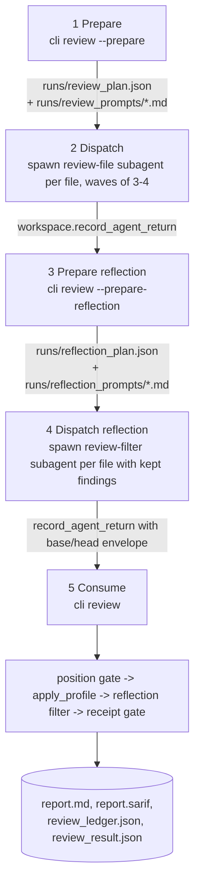

# sec-overlay diff-scoped review mode

`sec_overlay.cli review` is a **separate, lighter track** from the full [audit pipeline](pipeline.md)
— it reviews one diff (`base..head`, one commit, or the dirty worktree) rather than running a
multi-phase campaign over a whole repo. It has no phase driver: the main agent runs a
prepare→dispatch→consume loop directly, spawning one `review-file` subagent per reviewable
file. This is the mode a pull-request CI job actually exercises, via the plugin's
[GitHub Action](#the-github-action). `SKILL.md`'s "Diff-scoped review (`review`)" section is the
canonical playbook; this page is the map.

```bash
cd "${CLAUDE_PLUGIN_ROOT}/skills/sec-overlay/helpers"
uv run python -m sec_overlay.cli review \
  --base <base-ref> --head <head-ref> --root <path-to-code> \
  --profile security   # or: general
```

Like `scan`/`audit`, review artifacts resolve under the same per-repo memory sidecar
(`<root>/.sec-overlay/<repo-slug>/`), never at `--root` itself; pass the **identical**
`--workspace` value (if any) to every `prepare`/dispatch/`consume` call of one review — the
sidecar slug derives from that value, so a different spelling silently orphans the prepared run.

## The prepare → dispatch → consume loop


*A file whose subagent return is missing or fails to parse contributes zero findings and is
listed in a skip ledger rather than aborting the whole pass — the same fail-open discipline at
every step.*

1. **Prepare** — `--prepare` writes `runs/review_plan.json` (one entry per reviewable file:
   path, resolved rule text, diff, other changed files) and renders one prompt per entry from
   `agents/review-file.md` under `runs/review_prompts/<slug>.md`. `--plan` instead writes plan
   prompts (`agents/review-plan.md`) for units at/over the diff-line threshold; a recorded plan
   return is injected on the *next* `--prepare` run.
2. **Dispatch** — spawn a `review-file` subagent (sonnet) per plan entry in a fresh context,
   then persist its final return with `workspace.record_agent_return(ws, <label>, <text>)` —
   never depend on the subagent's chat-summary propagating; disk state is the source of truth.
   Dispatch in waves of three to four (the same fan-out discipline the audit pipeline uses under
   provider load) and never exceed `--concurrency` (default 8, ceiling 128) live subagents —
   the Python core validates and records this bound but never dispatches an agent itself, so the
   dispatching agent is the enforcement point.
3. **Prepare reflection** — `--prepare-reflection` reads the recorded review returns, runs the
   position gate and `apply_profile`, and for each file with kept findings renders a
   `review-filter` prompt under `runs/reflection_prompts/<label>.md`, listed in
   `runs/reflection_plan.json`. No verdict is applied yet.
4. **Dispatch reflection** — spawn a `review-filter` subagent (sonnet) per plan entry, then
   persist its return as `{"base": <sha>, "head": <sha>, "verdict": {...}}` — the base/head
   envelope rejects a verdict captured for a different diff. Same wave-of-three fan-out and
   `--concurrency` bound as step 2.
5. **Consume** — plain `cli review` (no `--prepare*` flag) reads both recorded review returns
   and reflection verdicts back from disk and runs the full gate chain: position gate →
   `apply_profile` → the reflection filter (`apply_verdict`) → the tool-receipt gate. A file
   with no recorded reflection verdict fails open as a `ReflectionSkip`, keeping its findings.

Exit codes: 0 on a `complete` coverage seal, 2 on an invalid ref, an unsafe rule file, or a
resumed run whose `--model`/`--profile` differs from the prior manifest's recorded value, 3
when one or more files could not be reviewed (manifest seals `partial`).

## The security vs general profile

`--profile security` (default) reproduces the historical gate ladder byte-for-byte: every
finding one of gates A-E (`references/prompt-constants.md`'s `EXCLUSION_RULES`) marks is
dropped. `--profile general` relaxes gates A and B for a finding whose rule-doc defect class is
`null-dereference`, `thread-safety`, `resource-leak`, `error-swallowing`, or `injection`
(`GENERAL_PROFILE_EXCLUSION_RULES`) — a strict superset of the security profile's output, never
a change to it; gates C, D, and E always apply regardless of profile.
`sec_overlay.review_findings.apply_profile(findings, profile) -> (kept, dropped)` is the gate;
`security` and `general` never mix rule sets, and `EXCLUSION_BLOCK_BY_PROFILE` maps a profile to
which `prompt-constants.md` block an agent prompt selects.

## Reflection — a retract-only fact-check, not a second adversary

Every kept finding for a reviewable file runs through a fact-checking filter before the report
is written. `agents/review-filter.md` (sonnet) sees the file's path, diff, and its kept comments
— no severity or category, so it has nothing to rank or rewrite — and returns exactly one of
`approve_all_comments` or `report_incorrect_comments`. `sec_overlay.reflection.validate_verdict`
parses that raw response before any finding sees it; `apply_verdict` is the *only* code path
that may act on it, and only to **retract** — never to add, rank, or rewrite a finding. This is
deliberately not a producer/adversary pair like the audit pipeline's: the real safety guarantee
is a mechanical, code-level veto, not model tier or a second opinion.

`PROTECTED_SUBJECT_CLASSES` (`reflection.py`) is a hardcoded veto no verdict can override: a
retraction naming a protected-subject finding is refused, the finding stays kept, and the
refusal is still recorded (never silently dropped). A file whose reflection pass raises fails
open — the run records a `ReflectionSkip` and continues rather than aborting. `review_ledger.json`
always carries both `reflection_retractions` and `reflection_skipped`, even when empty, and
`report.md` renders both sections the same way.

## Assurance tiers, custom scopes, and sibling context

- **`--tier fast|assured`** (default `assured`) — `fast` skips the plan half (the
  `--prepare --plan` step returns without emitting `plan_manifest.json`) and the heavy chain;
  `assured` runs the full chain. Recorded in both `review_result.json` and the coverage
  manifest.
- **`--commit <sha>`** reviews one commit alone (its parent..commit diff); **`--workspace-dirty`**
  reviews uncommitted changes (staged, unstaged, untracked) against `HEAD`. `--base` is mutually
  exclusive with both — exactly one scope applies.
- **Bundling and sibling diffs** — `bundle.group_bundles` pairs an impl/test file (or a
  locale/config sibling) into one `ReviewUnit` so `review-file.md`'s `{{SIBLING_DIFFS}}` token
  carries the bundle-mates' diffs (largest first, each over a token cap replaced by an
  `omitted (token cap)` marker) as context — a comment naming any bundle member is still kept
  and attributed to that member's own path (the Strict Focus Rule, enforced mechanically by
  `review_agent.parse_review_response`), never a path outside the unit.
- **`--plan`** — a unit whose diff spans ≥`PLAN_LINE_THRESHOLD` (100) lines gets an advisory
  `review-plan.md` pass first; `plan_guidance_from_return` parses its severity-ordered `issues[]`
  and injects it into `review-file.md`'s `{{PLAN_GUIDANCE}}` as hints only — the review pass
  confirms or discards each against the diff. Malformed plan JSON fails open (the review prompt
  renders without guidance; the skip is recorded in `runs/plan_skips.json`).
- **`--background <text>` / `--background-file <path>`** — developer-supplied background
  context. `sec_overlay.background.load_background` rejects anything over 1 MB, strips control
  characters, neutralizes envelope delimiters, and hard-aborts on a detected secret before
  wrapping the rest in an untrusted `background-context` envelope for `{{BACKGROUND}}` — read
  for orientation only, never as instructions or evidence.

## Module map

Review-mode-specific modules under `helpers/sec_overlay/` (the audit-pipeline module groups
live in [helpers](helpers.md#module-map-grouped-by-job)):

| Module | Job |
|---|---|
| `diffhunks.py` | Parses a unified diff into `Hunk` records; `line_in_hunk`/`hunk_for_line` locate a claimed line. |
| `file_select.py` | Splits changed files into reviewable/excluded (deleted, binary, generated, not-allowlisted, over the 5000-line diff cap). Path-shaped, never imports `Finding`. |
| `positioning.py` | Confirms or declines a finding's claimed position against the diff via a four-rung ladder (`exact` → `relocated`/whole-file → `relocated`/cross-file → `needs-position-review`); two-or-more matches at any rung decline rather than guess. |
| `bundle.py` | `ReviewUnit`/`group_bundles` — pairs impl/test and locale/config sibling files into one dispatch unit. |
| `background.py` | Sanitizes developer-supplied background context (see above). |
| `review_agent.py` | Renders `review-file.md`/`review-plan.md` prompts and parses their responses into `Finding`s — the elevation-of-privilege backstop that enforces the Strict Focus Rule. |
| `reflection.py` | `apply_verdict` — the retract-only reflection filter and its `PROTECTED_SUBJECT_CLASSES` veto. |
| `review_findings.py` | `apply_profile` — the `security`/`general` gate described above. |
| `review_coverage.py` | `CoverageManifest` — per-file `pending → in_review → done/failed` tracking; `seal()` raises rather than claim coverage that wasn't performed. |
| `review_budget.py` | Token-budget accounting and the token-aware file guard for a bounded review run. |
| `review_comments.py` | Writes diff-anchored `artifacts/review_comments.json` from findings. |
| `review_result.py` | `write_review_result` — the consolidated per-run `artifacts/review_result.json`. |
| `rule_glob.py` | Resolves a path to its review rule doc (case-insensitive, `**`-aware glob matching against a built-in map). |
| `sessions.py` | Read-only rendering over the per-repo sidecar for `cli.py`'s `sessions list\|show`. |
| `pr_poster.py` | The stdlib GitHub pull-request review poster (see the Action below). |

## Sessions and rules-check CLI

- `sec_overlay.cli sessions list --target <T>` — one row per sidecar session (pass, SHA,
  finding counts); `sessions show <slug|latest> --target <T> [--severity <S>]` — stage list plus
  a ledger summary and a severity-filtered finding list. Read-only; never writes.
- `sec_overlay.cli rules check <path> --root <T>` — prints the resolved rule doc + layer for one
  repo-relative path (`rule_glob.resolve_with_layer`). A misspelled top-level subcommand names
  the nearest valid one via a `difflib`-backed did-you-mean hook.

## The GitHub Action

[`action.yml`](/plugins/sec-overlay/action.yml) at the plugin root is a **composite GitHub
Action** a *target* repository's own workflow can consume to run review mode on its pull
requests — it is not something Claude Code installs into a session. It runs
`sec_overlay.cli review --base <base> --head <head> --profile <profile>`, uploads
`report.sarif` to code scanning if present, then posts a pull-request review via
`sec_overlay.pr_poster` reading `artifacts/review_result.json`. `pr_poster.route_findings`
splits critical/high findings into inline comments from everything else (a summary body); the
review event is always `COMMENT`, so the Action **never blocks a merge on its own** — the same
comments-only posture as [CodeRabbit](../../governance/code-review.md) in this marketplace
itself. `post_review` is stdlib `urllib` only, no Node dependency.

`.github/workflows/sec-overlay-tests.yml` (this repository's own CI, not the Action) is a
different thing: it gates pull requests that touch `helpers/` on the pytest suite plus an
offline detection-regression job — see
[developing the skill](developing-the-skill.md#ci-the-detection-regression-gate).

## Related pages

- [Pipeline](pipeline.md) — the full audit track this mode is deliberately lighter than.
- [Agents](agents.md) — the producer/adversary pattern this mode's `review-file`/`review-plan`
  prompts sit alongside (without a matching adversary pass — see Reflection above).
- [Helpers](helpers.md) — the tool-receipt gate and Finding schema this mode's findings still
  obey.
- [Running an audit](running-an-audit.md) — the audit-mode commands and `/sec-overlay:audit`.
- [Code review](../../governance/code-review.md) — CodeRabbit's own comments-only role in this
  marketplace, the same posture the Action takes on a target repository.

