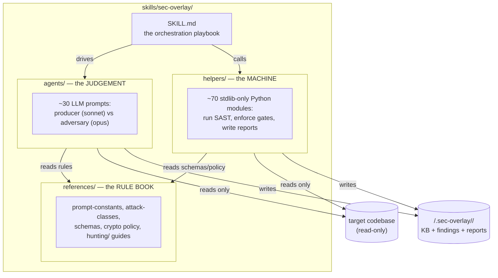

# sec-overlay

A self-contained, **agentic security-audit harness**. Point it at a codebase and it finds
*actually-exploitable* vulnerabilities, then hands a security engineer artifacts they can act
on: a threat model, per-finding evidence, a SARIF file, a Markdown report, and a manual
runtime-test plan.

The core idea in one sentence: **run cheap mechanical tools to find candidates, use LLM
agents to investigate whether each candidate is real, and never let an LLM's opinion alone
confirm a finding — a mechanical tool receipt is always required.**

This README is the map. It explains *how the whole thing fits together* and hands you off to
the three folder READMEs and the operational playbook for detail.

| To understand… | Read |
|----------------|------|
| The full phase-by-phase operating playbook, and the diff-scoped `review` mode (`--profile security\|general`, REV-01), including its prepare/dispatch/consume subagent loop (`agents/review-file.md`, bounded to `--concurrency` live subagents at once, SCALE-02) and its retract-only reflection pass (D-16) | [`SKILL.md`](SKILL.md) |
| Environment setup, how to run an audit | [`CLAUDE.md`](CLAUDE.md) |
| Git protocol, developing the skill | [`../../CLAUDE.md`](../../CLAUDE.md) |
| The LLM prompts that investigate/validate/patch | [`agents/README.md`](agents/README.md) |
| The Python core that runs tools & enforces gates | [`helpers/README.md`](helpers/README.md) |
| The rule book (severity, scope, schemas, crypto policy) | [`references/README.md`](references/README.md) |

---

## The four invariants (what makes findings trustworthy)

These hold everywhere and are enforced in code where possible, prompt otherwise:

1. **Never executes or modifies the reviewed source.** Static analysis only. Patches are
   applied to a *throwaway copy* to verify them — the repo's own files are never run or edited.
2. **Writes only its own sidecar.** All output lives in an in-repo, self-ignoring
   `<target>/.sec-overlay/<slug>/` directory (override the base with `$SEC_OVERLAY_HOME`, or
   the whole workspace with `--workspace`). A seeded `.sec-overlay/.gitignore` keeps output
   out of the reviewed repo's git tree. `review` shares this convention with one added branch:
   omit `--workspace` and it falls back to the same per-repo sidecar as `scan`/`audit`; supply
   `--workspace` and it uses that value instead. Whichever branch applies, pass the same value to
   every invocation of one run.
   Pass the same `--model` string too (SCALE-03) — a resumed `review` with a different
   `--model` is rejected (exit 2) instead of mixing findings from two models on one manifest.
3. **Tool-receipt gate.** A finding reaches `confirmed`/`fixed` only with ≥1 mechanical
   receipt (`semgrep` / `codeql` / `ast-grep` / `tree-sitter` / `ripgrep` /
   `structural-index` / `secrets` / `sca`). LLM reasoning is namespaced `llm-claimed:` and can
   corroborate but **never** confirm. Enforced in `helpers/…/findings_gate.py`.
4. **Signal over noise.** Every load-bearing claim made by a Sonnet "producer" is attacked by
   an Opus "adversary" on a different model family; a false-positive ladder + a
   `needs-deployment-testing` verdict for bugs unprovable-from-source keep the report clean.

---

## Architecture — three folders, three jobs



- **`references/`** is stated once, obeyed everywhere — severity bands, scope rules, JSON
  schemas, the crypto allow/deny lists, and the deep hunting guides. → [details](references/README.md)
- **`agents/`** are the LLM prompts. Producers (Sonnet) find things; adversaries (Opus, a
  different family) try to prove them wrong. → [details](agents/README.md)
- **`helpers/`** is the deterministic Python that runs the tools and *enforces the gates no
  LLM is trusted to enforce.* Stdlib-only. → [details](helpers/README.md)

The main agent (you, driving [`SKILL.md`](SKILL.md)) is the orchestrator: it calls a Python
step, spawns an agent, records the phase, calls the next Python step.

---

## The pipeline

One audit pass, in order. Deterministic (Python) steps are rectangles; agent (LLM) steps are

```mermaid
flowchart TD
    P0["0 · preflight<br/>tools + CodeQL packs present?"] --> P1["1 · begin_pass<br/>pin SHA"]
    P1 --> C1(("C1 · context-ingest → context-adversary<br/>repo docs as UNTRUSTED leads"))
    C1 --> T1["T1 · graph build<br/>Tier-1 substrate (LLM-free)"]
    T1 --> RA(("2 · recon → architecture<br/>gated by phase-adversary (opus)"))
    RA --> AG2["3.5 · arch-gate<br/>diagram_gate + ste_lint, halts on violation"]
    AG2 --> TM(("4 · threat-model<br/>gated by phase-adversary (opus)"))
    TM --> TG["4.5 · tm-gate<br/>diagram_gate + ste_lint + duplication check"]
    TG --> PRE["5 · prefilter<br/>semgrep+codeql+sca+secrets, never-silent"]
    PRE --> INV(("6 · investigate<br/>parallel per class, loop-until-dry"))
    INV --> DED["7 · dedupe<br/>refactor-resistant fingerprint"]
    DED --> CLUS["7.5 · cluster<br/>≥3 same-class/sink -> systemic cluster"]
    CLUS --> LAD(("8-9 · critic → judge → validate(opus refutes)"))
    LAD --> CAL["10 · calibrate<br/>risk_score 1-10 + citations"]
    CAL --> PAT(("11 · patch(opus) → validate-fix"))
    PAT --> VER["12 · verify<br/>apply patch to COPY, re-scan"]
    VER --> GATE["13 · findings_gate"]
    GATE --> REP["14 · report<br/>report.sarif + report.md"]
    REP --> RT(("14.4 · redteam → redteam-adversary"))
    RT --> RTR["redteam.py → redteam-plan.md"]
    RTR --> AG["14.5 · artifact_gate<br/>deterministic self-check (requires redteam-plan.md)"]
    AG --> AR(("14.6 · artifact-review (opus)<br/>claim↔evidence over the rendered report"))
    AR --> C2["15 · postflight<br/>durable prior_context.json"]
```

rounded. `<T>` = target, `<WS>` = workspace.



The phase legend with exact commands is in [`SKILL.md`](SKILL.md); the hard operating rules
(a partial scan is a coverage hole, not "clean") are in [`CLAUDE.md`](CLAUDE.md) §2.

---

## Worked example — one SQL-injection finding, end to end

To make the flow concrete, here is what happens to a single bug as it moves through the
pipeline. Say the target is a Flask app with this route:

```python
# app/routes.py
@app.route("/user")
def get_user():
    uid = request.args.get("id")               # attacker-controlled
    return db.execute("SELECT * FROM users WHERE id = " + uid)   # string-built SQL
```

| Phase | What runs | What happens to this bug | Artifact touched |
|-------|-----------|--------------------------|------------------|
| **C1 context** | `context-ingest` (sonnet) | Reads the repo's docs; a runbook *claims* "all inputs validated by middleware." That claim is tagged **untrusted** — it becomes a lead to verify, not a safe-list. | `kb/context.json` |
| **T1 substrate** | `graph build` (no LLM) | Builds a call graph: `request.args` is an entry point; `db.execute` is a sink; there's a one-hop edge between them. | `kb/graph.json` |
| **2-4 analysis** | recon → architecture → arch-gate → threat-model (STRIDE) → tm-gate | `injection` lands on the prioritized hunt list because recon saw Flask + raw SQL; opus phase-adversary confirms the entrypoint claim resolves to real code. | `kb/scan-profile.json`, `threat-model/threat-model.md` |
| **5 prefilter** | semgrep + codeql (no LLM) | semgrep's SQLi rule fires on line 4 → a **candidate** with a real receipt `semgrep:<rule>`. | `findings/C-0001.json` (candidate) |
| **6 investigate** | `investigate.md` (sonnet, `injection`) | Walks the gate ladder: cited code exists (Gate −1 ✓), reachable from `request.args` (Gate 1 ✓, `codeql:dataflow` receipt), `uid` is attacker-controlled (Gate 2a ✓), **reads the claimed middleware — it only trims whitespace, doesn't parameterize** (Gate 2b: sanitizer does *not* apply ✓), yields DB read/write (Gate 3 ✓). Promoted to **`raw`**. | status → `raw` |
| **7 dedupe** | `dedupe` (no LLM) | Stamps fingerprint `sha256(sqli\|injection\|get_user)` so a later refactor that shifts the line still maps to the same finding. | `fingerprint` field |
| **7.5 cluster** | `cluster` (no LLM) | Only one route hits this sink, so no group of ≥3 forms — `cluster_id` stays unset. | none (single-site finding) |
| **8 critic** | `critic.md` (sonnet) | It's on a live route, not debug/test code → stays `raw`. | history: `critic:viable` |
| **9 validate** | `validate.md` (**opus**) | *Assumes it's wrong* and re-traces independently, trying to refute. Cannot find a sanitizer on any path → **survives** → **`confirmed`**. (To reject it would have needed a `file:line` cite of a real defeating control.) | status → `confirmed` |
| **10 calibrate** | `calibrate` (no LLM) | Preconditions enumerated first (unauthenticated, no WAF assumed) → CVSS computed by formula → `risk_score: 9`. ASVS/CodeGuard citations auto-attached. | `risk_score`, `asvs_ids` |
| **11 patch** | `patch.md` (opus) | Proposes a parameterized-query diff into `patch_diff` — against a *copy*, never the real file. | `patch_diff` |
| **12 verify** | `verify` (no LLM) | Applies the diff to a temp copy, re-runs semgrep → the rule no longer fires → **`fixed` / verified-static**. | status → `fixed` |
| **14 report** | `report` (no LLM) | Renders the finding into `report.md` (9-section template) and `report.sarif`. | `report.md`, `report.sarif` |
| **14.4 redteam** | `redteam` → `redteam-adversary` | Marks it `static-settled` (source proves it) but still writes a `runtime_test` with a `$PAYLOAD` shell var so an operator can confirm live; opus adversary keeps it (payload ties to the real sink). `artifact_gate` hard-requires this file, so redteam runs before it, not after. | `redteam-plan.md` |
| **14.5 artifact_gate** | `artifact_gate` (no LLM) | Checks the finding has a detail file and a red-team directive, and that its triage-table `what` cell isn't stale or over-long. Passes. | `kb/gates/artifact-gate.json` |
| **14.6 artifact-review** | `artifact-review.md` (**opus**) | Reads the finding's tool receipt against `report.md`'s claim — they match, impact text is honest, red-team coverage is present. No demotion, no re-render forced. | `kb/gates/artifact-review.json` |
| **15 postflight** | `postflight` | Records "confirmed SQLi in get_user, fixed at <sha>" into durable memory so the next scan doesn't re-litigate it. | `kb/prior_context.json` |

The point of the table: **no single step is trusted.** A tool found it, a sonnet agent
investigated it, an opus agent tried to kill it, a deterministic module scored it, and a
second deterministic module proved the fix — each leaving a receipt on disk.

---

## How to run it

### Quick deterministic smoke scan (no agents)
Fastest way to see output. From `helpers/`:

```bash
cd helpers
uv run python -m sec_overlay.cli scan \
  --target <path-to-code> \
  --config rules/smoke.yaml \
  --sha "$(git -C <path-to-code> rev-parse HEAD)"
# workspace defaults to <target>/.sec-overlay/<slug>/
```

This runs semgrep → normalize → SARIF/Markdown only. It is the smoke path, **not** a real
audit (no agents, no gate ladder).

> **Semgrep ruleset is a prerequisite.** The bundled `rules/smoke.yaml` is a minimal
> ruleset. The vendored, gitignored semgrep-rules clone (`helpers/rules/semgrep/`) is not
> part of the plugin. For fuller coverage, point `--config` (and the recon agent's
> `rulesets`) at your own semgrep ruleset.

### Full agentic audit
Driven by the main agent following [`SKILL.md`](SKILL.md). The short version:

```bash
cd helpers
uv run python -m sec_overlay.preflight        # 0 — verify semgrep/codeql/ast-grep + CodeQL packs
# 1  begin_pass(ws: Workspace, sha: str | None) -> CampaignState
# C1 spawn agents/context-ingest.md → context-adversary.md
uv run python -m sec_overlay.graph build --target <T> --workspace <WS> --sha <sha>   # T1
# 2-4 spawn recon → architecture → threat-model (+ phase-adversary each)
# 5  from sec_overlay.prefilter import run_prefilter; run_prefilter(ws, target, profile)
# 6  spawn agents/investigate.md in parallel per attack class
uv run python -m sec_overlay.dedupe        --workspace <WS>    # 7
uv run python -m sec_overlay.cluster       --workspace <WS>    # 7.5
# 8-9 spawn critic → judge → validate
uv run python -m sec_overlay.calibrate     --workspace <WS>    # 10
# 11 spawn patch → validate-fix
uv run python -m sec_overlay.verify        --workspace <WS> --target <T> --config <rules>   # 12
uv run python -m sec_overlay.findings_gate --workspace <WS>    # 13
uv run python -m sec_overlay.report        --workspace <WS>    # 14
uv run python -m sec_overlay.selfscore     --workspace <WS>
# 14.4 spawn redteam → redteam-adversary (before artifact_gate: it hard-requires redteam-plan.md)
uv run python -m sec_overlay.redteam       --workspace <WS>
uv run python -m sec_overlay.artifact_gate --workspace <WS>    # 14.5
# 14.6 spawn agents/artifact-review.md (opus)
uv run python -m sec_overlay.postflight    --workspace <WS> --sha <sha>   # 15, final phase
```

> **A scan is clean only if every planned backend actually ran.** If `preflight` shows a
> missing CodeQL pack, that language has *zero dataflow coverage* — a partial scan is a
> coverage hole, not "no findings." See [`CLAUDE.md`](CLAUDE.md) §2.

---

## What you get — the output workspace

Everything lands in `<target>/.sec-overlay/<slug>/` (self-ignoring):

```
kb/scan-profile.json      recon output: languages, frameworks, attack_surface, sast_plan
architecture/             C4 diagrams + runtime views + arc42.md (building blocks in §5)
threat-model/             dfd.mmd (derived) + attack-sequences/ + threat-model.md (hunt list)
kb/context.json           the repo's own docs distilled, trust-tagged
kb/graph.json             the Tier-1/Tier-2 code graph (reachability substrate)
kb/gates/<phase>.json     adversary verdict audit trail per gated phase
kb/gates/arch-gate.json, tm-gate.json   deterministic gates (diagram caps, STE prose, dup) — each
                          phase is double-gated: opus phase-adversary first, then this check
kb/coverage-ledger.json   surface-completeness (blocks "complete" while gaps remain)
kb/discovery-ledger.json  investigate saturation state
findings/<ID>.json        every finding, all statuses — evidence, reachability, cvss, patch
report.sarif              SARIF 2.1.0 (confirmed/fixed)
report.md                 the human report (finding-template structure)
kb/gates/artifact-gate.json    deterministic artifact self-check result
kb/gates/artifact-review.json  opus adversary verdict over the rendered report
redteam-plan.md           the manual runtime test plan — the engineer's follow-up
state.json                campaign state (pass number, pinned SHA, stages)
MEMORY.md, learnings/     durable per-repo memory across runs
```

**Resume** an interrupted run: `python -m sec_overlay.cli memory --target <T>` reports
`{finished, resumable, next_phase, stages_done}`.

---

## Develop

From `helpers/` (stdlib-only core; dev deps pytest/ruff/ty):

```bash
uv run pytest -q          # 575 tests (2 env-only failures — see CLAUDE.md §1)
uv run ruff check sec_overlay/ bench/ tests/
uv run ty check
```

One coupling point to respect before editing:

- **The finding contract.** `helpers/sec_overlay/models.py` and `evidence.py` define the finding
  serialization/schema. Change a field and you must update `references/finding.schema.json` and keep
  `helpers/tests/test_contracts.py` and `helpers/tests/test_finding_schema.py` green.
- **Docs track code.** When you change anything in `agents/`, `helpers/`, or `references/`,
  update that folder's README in the **same commit**. A pre-commit hook enforces this — see
  [`../../CLAUDE.md`](../../CLAUDE.md).
- **Version bumps are automatic.** A commit that changes a shipping file (`plugin.json`,
  `SKILL.md`, or anything under `skills/`, `agents/`, `helpers/`, `references/`, incl. their
  READMEs) bumps `.claude-plugin/plugin.json` by Conventional-Commits semver — see the
  marketplace root [`CLAUDE.md`](../../../../CLAUDE.md).
- **Prompt rendering is loud.** `helpers/sec_overlay/prompts.py`'s `render_prompt` substitutes
  `{{KEY}}` tokens and raises if any remain — CLAUDE.md §2 has the orchestrator render every
  dispatched agent prompt through it instead of hand-substituting tokens.
